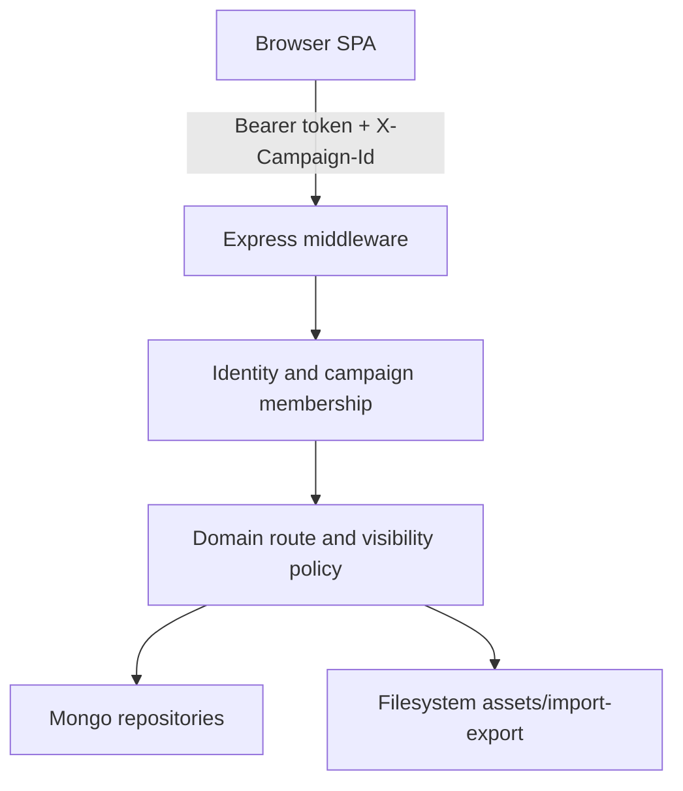

# PF2 Party Codex current-state repository audit

- **Audit:** HED-20 / GitHub #34
- **Audit date:** 2026-08-17
- **Audited baseline:** `origin/main` at `372f88fc070313c351ddce830647c355db8a39b7`
- **Scope:** repository evidence and migration constraints only; no runtime or data migration changes

## Executive verdict

The repository is a working JavaScript monorepo with an Express/MongoDB backend and a React/Vite single-page application. It already contains meaningful campaign tenancy, backend visibility enforcement, invitations, archive entry storage, world-system records, notes, characters, imports, audit logging, and deployment checks. Those domain behaviors are worth preserving.

It is **not safe to begin a broad Next.js rewrite yet**. The first implementation must extract and test the identity, campaign-context, visibility, and archive-entry contracts before any UI cutover. The current system has five migration-critical ambiguities:

1. Archive concepts are represented both as generic `entries` and as dedicated collections (`maps`, `timelineEvents`, `sessions`, `handouts`). The archive aggregate chooses between them at read time instead of defining one canonical owner.
2. Visibility is enforced on the backend, but different modules use different vocabularies and serializers. That makes a mechanical port unsafe.
3. Authentication uses a custom Bearer token stored in browser `localStorage`. This contract does not fit React Server Components or secure server-side session access without an explicit compatibility/cookie transition.
4. Markdown is correctly described as compatibility storage, but a diagnostic no-Mongo mode still starts a live filesystem vault and watcher. Assets and generated Foundry exports are also local filesystem state.
5. The frontend is an untyped, client-only router with a monolithic application state owner and a 21-file override-heavy CSS stack. Copying it wholesale would carry its coupling into the new app.

The safe first vertical slice is therefore: **typed domain contracts -> auth/session adapter -> exact campaign membership and backend visibility -> campaign shell -> one archive-entry read -> one archive-entry write**. The exact prerequisite task is specified in `docs/architecture/NEXTJS_MIGRATION_SEQUENCE.md`.

## Audit safety and baseline

- A separate clean clone was created because the user workstation checkout was not available to this environment.
- `git status --short --branch` was clean before the audit.
- local `main`, `origin/main`, and `HEAD` all resolved to `372f88fc070313c351ddce830647c355db8a39b7`.
- GitHub draft PR #33 (`agent/archive-ui-cleanup`) was deliberately excluded as a baseline. It must be reviewed or ported separately after the contract decisions below.
- The repository did not contain a root `AGENTS.md`; HED-20 adds one with audit-derived guardrails.
- No MongoDB, production service, destructive script, dependency upgrade, package install, or runtime source file was changed.

## Actual repository topology

| Area | Current owner and evidence | Current role | Migration consequence |
|---|---|---|---|
| Workspace orchestration | root `package.json`, `package-lock.json`, `.nvmrc` | npm workspaces for server and web; Node `>=24 <25` | Preserve the monorepo boundary initially; add strict TypeScript packages beside current apps before cutover. |
| API runtime | `apps/server/src/index.js`, `apps/server/src/app.js` | Express startup, middleware, 107 route registrations, Vite static serving | Keep as compatibility API until typed contracts and vertical-slice parity exist. Do not bury it inside Next route handlers in one step. |
| Configuration | `apps/server/src/config.js`, `.env.example` | Environment validation and local paths | Split environment parsing into a typed server-only package; keep secrets out of client bundles. |
| Persistence | `apps/server/src/db/mongo.js`, `apps/server/src/db/indexes.js`, `apps/server/src/repositories/*` | MongoDB repositories plus index bootstrap | Mongo remains the source of truth. Separate schema migration/backfill jobs from normal startup. |
| Domain services | `apps/server/src/services/*` | Identity, visibility, archive compatibility, import/export, PF2 helpers, email | Extract contracts and policy from transport and filesystem concerns; port by domain, not by file extension. |
| SPA | `apps/web/src/main.jsx`, `apps/web/src/App.jsx` | React Router client application and global state owner | Rewrite the application boundary for Next App Router; reuse selected visual/domain components only after dependency review. |
| API client | `apps/web/src/api/client.js`, `apps/web/src/api/characterAssignments.js` | localStorage Bearer token, active-campaign header, untyped request surface | Replace with one typed transport. Introduce an explicit session compatibility adapter before server rendering. |
| UI components | `apps/web/src/components/*`, `apps/web/src/components/ui/*`, `apps/web/src/pages/*` | Mixed reusable components, route screens, legacy class contracts | Review component by component. Do not copy route screens or the current global state owner wholesale. |
| Styling | `apps/web/src/styles/index.css` and 20 imported CSS files | Token, component, stage, stabilization, and hotfix layers | Preserve visual intent and durable tokens; rebuild style ownership and delete stage/hotfix layers after parity. |
| Operational scripts | `scripts/*`, `.github/workflows/ci.yml`, `Dockerfile` | QA, vault normalization, seed/migration helpers, CI and container build | Preserve safe dry-run tools and production checks; gate write scripts and align CI with strict TS later. |
| Tests | `tests/*.test.mjs` | 22 Node test files, mostly source-contract and pure-function characterization | Keep as a temporary compatibility net; add behavioral repository/API tests and typed contract tests before cutover. |

The repository is JavaScript-only in application code: there is no `tsconfig.json`, no Next.js dependency, and no TypeScript application package. The audit counted approximately 43,000 lines across application, script, test, and documentation files. The largest individual implementation files include `apps/web/src/styles/components.css`, `apps/server/src/services/vaultService.js`, and `apps/web/src/App.jsx`, which are all high-coupling migration zones.

## Runtime and request flow

1. `apps/web/src/main.jsx` starts a BrowserRouter SPA. `apps/web/src/App.jsx` owns session, active campaign, page list, category list, and most route composition.
2. `apps/web/src/api/client.js` reads the session token and active campaign from `localStorage`, sends `Authorization: Bearer ...` and `X-Campaign-Id`, and manually assembles the API surface. `apps/web/src/api/characterAssignments.js` duplicates direct-fetch behavior outside that client.
3. `apps/server/src/app.js` attaches a user from the custom HMAC token, applies request controls, and mounts domain routers.
4. `apps/server/src/services/sessionService.js` resolves a requested campaign from params, body, query, or header and revalidates exact active membership. Frontend route guards are convenience only; backend middleware is the security boundary.
5. Repositories scope most campaign reads/writes by `campaignId` and serialize player-safe views before returning data.

## Identity, session, tenancy, and roles

### Current behavior worth preserving

- `apps/server/src/services/authStore.js` implements password hashing, verification/reset tokens, email verification, account activation checks, and `sessionVersion` revocation.
- `apps/server/src/services/authTokens.js` signs expiring HMAC session payloads containing user ID and session version.
- `apps/server/src/repositories/identityRepository.js` models users, workspaces, campaigns, and one membership per user/campaign. It resolves an exact campaign context and persists an active campaign preference.
- `apps/server/src/services/sessionService.js` exposes separate `requireCampaignMember` and `requireGm` checks.
- `apps/server/src/repositories/membershipManagementRepository.js` and `apps/server/src/routes/memberships.js` keep `owner`, `gm`, and `player` campaign roles distinct.
- `apps/server/src/services/platformAccessService.js` and `apps/server/src/middleware/platformAccess.js` keep platform administration separate from campaign roles.
- `apps/server/src/repositories/invitationsRepository.js` stores token hashes, not invitation secrets, and activates the invited campaign membership on acceptance.

### Migration blockers and decisions

| Finding | Evidence | Required decision |
|---|---|---|
| Browser-owned session | `apps/web/src/api/client.js` stores a Bearer token in `localStorage`. | Define a same-origin, HttpOnly, Secure, SameSite cookie session or a temporary backend-for-frontend exchange. Never expose the legacy token to Server Components. |
| Campaign context has several inputs | `apps/server/src/services/sessionService.js` accepts params/body/query/header, while the SPA persists its own active campaign. | Make route identity (`/campaigns/[campaignId]`) canonical; headers may be compatibility-only. Every repository call still receives a server-verified context. |
| Invalid requested campaign can fall back in session display | `sessionInfo` in `apps/server/src/services/sessionService.js` can select a default membership for presentation. | Separate “list/select available campaign” from “authorize requested campaign”; protected operations must fail closed. |
| Onboarding rollback is application-managed | `apps/server/src/routes/onboarding.js`, `apps/server/src/repositories/identityRepository.js` | Use a Mongo transaction or idempotent saga for workspace/campaign/owner-membership creation. |
| Index startup includes data mutation | `ensureIdentityIndexes()` calls `backfillWorkspaceIds()` in `apps/server/src/repositories/identityRepository.js`. | Move backfill to a versioned, observable migration command. Startup may create verified indexes but must not silently rewrite domain data. |

## Data authority map

MongoDB is the required domain source of truth. Markdown, Foundry files, and local vault content are import/export or diagnostic compatibility only. Binary asset bytes can live in object storage, but their ownership and metadata must be represented explicitly rather than inferred from a local directory.

| Domain | Current collection or storage | Current owner | Authority/risk finding |
|---|---|---|---|
| Accounts | `users` | `authStore.js`, `identityRepository.js` | Canonical Mongo identity; preserve. |
| Profiles | `profiles` | `profilesRepository.js` | Canonical Mongo profile; preserve and type. |
| Billing tenant | `workspaces` | `identityRepository.js`, `entitlementsService.js` | Correct aggregate boundary for GM-paid workspace; billing is currently disabled/manual. |
| Campaign | `campaigns` | `identityRepository.js` | Canonical campaign record. |
| Campaign access | `memberships` | identity and membership repositories | Canonical authorization relation; keep exact campaign scope. |
| Archive article | `entries` | `entriesRepository.js`, `campaignContentService.js` | Best candidate for canonical archive record. Current page-shaped compatibility mapping must be typed. |
| Archive relations | `entryRelations` plus computed links | `entriesRepository.js`, `campaignContentService.js`, `vaultImportService.js` | Imported relations are stored, while normal page flows recompute from frontmatter/wiki links. Choose one canonical derivation policy. |
| Notes | `notes` | `notesRepository.js` | Dedicated record with a separate visibility vocabulary. Preserve behavior, unify policy types. |
| Character dossier | `characters` | `charactersRepository.js`, character services | Mongo-backed, but persistence always invokes PF2 enrichment. Split system-neutral dossier data from PF2 adapters. |
| Maps | `maps`, `mapObjects`, and map-like `entries` | `worldSystemsRepository.js`, `archive.js`, map pages | Two representations contribute to the archive. Declare dedicated map records or entry projections canonical before migration. |
| Timeline | `timelineEvents` and timeline-like `entries` | `worldSystemsRepository.js`, `archive.js` | Same dual-authority problem. |
| Sessions | `sessions` and session-like `entries` | `worldSystemsRepository.js`, `archive.js` | Same dual-authority problem; session-runner UI is beyond archive-first MVP. |
| Handouts/reveal | `handouts` | `worldSystemsRepository.js`, `revealService.js` | Reveal snapshots are inserted into the handout collection with `source.kind=playerReveal`; define lifecycle/retention explicitly. |
| Asset metadata | planned `assets` index, but no active repository | `db/indexes.js` | Planned collection is not used. Current application infers assets from files and entry references. |
| Asset bytes | local `data/campaign-assets/<campaign>` | `campaignAssetsService.js`, `routes/tools.js`, `routes/assets.js` | Not horizontally safe and not backed up by Mongo. Move to an object-store port with Mongo metadata; retain signed/authorized access. |
| Invitations | `invitations` | `invitationsRepository.js` | Canonical and token-hash based; preserve trust rules. |
| Email delivery | `emailOutbox` | `emailService.js` | Durable outbox and retry worker; preserve idempotency and move worker ownership out of web startup when scaling. |
| Audit trail | `auditLogs` | `auditLogService.js` | Best-effort writes are intentionally non-blocking. Define retention and failure observability. |
| Imports | `importJobs` | `entriesRepository.js`, `vaultImportService.js` | Commit and rollback are campaign-scoped. Dry-run is read-only; preserve that property. |
| Markdown vault | local vault directory | `vaultService.js`, `fileWatchService.js` | Compatibility/diagnostic mode only. Retire as a live application authority after import/export parity. |
| Foundry packages | local generated exports | `foundryExportService.js` | Batch interoperability, not an event integration. Treat generated files as ephemeral job output. |

### Confirmed dual-read behavior

`apps/server/src/routes/archive.js` aggregates recent items and counts from multiple collections. For maps, timeline events, and sessions it prefers entry-backed results when they exist and otherwise falls back to dedicated collections. This hides migration state from callers but does not define ownership. The same file uses a narrower GM character query than `apps/server/src/repositories/charactersRepository.js`, so archive counts can disagree with the character management view. Both differences require characterization tests and an explicit canonical model before porting the archive summary.

## Visibility and player-safety boundary

Backend enforcement is present and must remain non-negotiable:

- `apps/server/src/repositories/entriesRepository.js` returns `playerSafeEntry` only for `public`/`revealed`, non-draft content and removes GM content and private source metadata.
- `apps/server/src/repositories/worldSystemsRepository.js` filters maps, layers, map objects, timeline GM notes, session preparation fields, and handouts by role and visibility.
- `apps/server/src/repositories/notesRepository.js` scopes private, GM-shared, party-visible, and GM-private notes.
- `apps/server/src/routes/assets.js` derives the player-readable asset set from player-visible campaign pages.
- `apps/server/src/services/revealService.js` resolves the source entry in player mode before creating a reveal snapshot.

The policy is nevertheless fragmented:

| Area | Values observed |
|---|---|
| Entries/maps/timeline/sessions | `public`, `revealed`, `gmOnly`, `hidden`, `needsReview` |
| Markdown compatibility | aliases such as `player-visible`, `gm-only`, `review-needed`, `private`, `secret`, `draft` |
| Notes | `private`, `sharedWithGm`, `partyVisible`, `gmPrivate` |
| Handouts | `partyVisible`, `specificPlayers`, `gmOnly` |
| Characters | booleans such as `sharedWithGm` and `visibleToParty` |

The target needs a small policy algebra, not one indiscriminate enum: resource state, audience grant, and publication/review state are different concepts. A single backend policy package must turn those concepts into Mongo predicates and response serializers. UI hiding is never authorization.

## Archive, import/export, and integration coupling

### Archive/content

`apps/server/src/services/campaignContentService.js` adapts Mongo entries into the legacy Markdown-page shape, builds search indexes in memory per request, and recomputes relations over bounded lists. This is useful compatibility code but should not become the new domain model. The regular save path also normalizes visibility more narrowly than some import values, so `needsReview` requires a deliberate state-transition contract.

### Markdown/vault

`apps/server/src/services/vaultService.js` is a large filesystem application inside the server. In no-Mongo diagnostic mode, `apps/server/src/index.js` rebuilds its index and starts `apps/server/src/services/fileWatchService.js`. Target behavior:

- keep Markdown preview/import/export and safe-path utilities;
- keep dry-run and campaign-scoped rollback semantics;
- retire vault watching and direct filesystem CRUD from the production request path;
- never treat Markdown as a second source of truth.

### Foundry

`apps/server/src/services/foundryImportService.js` and `foundryExportService.js` implement batch Journal JSON conversion. Import currently defaults normalized entries toward public visibility, which is unsafe for unreviewed third-party data. New imports should enter a review-required state unless an explicit trusted policy says otherwise.

There is no event adapter, source-event ID, deduplication ledger, or replay/evidence log. Therefore the current implementation is not the planned Foundry module integration. Any future module must send archive events through an idempotent ingestion port and preserve the source payload/evidence needed to audit AI-generated updates.

### AI Archivist

No production-grade AI Archivist event pipeline, evidence model, proposal/review state machine, or idempotent ingestion contract is present in the audited baseline. It must be designed as a separate domain after the archive and visibility contracts stabilize; it must not be inferred from current content-generation helpers.

## System-neutral core and PF2 coupling

The current repository is substantially PF2-branded and contains direct rules/data coupling:

- `apps/server/src/repositories/charactersRepository.js` calls `enrichPf2Character` for persisted character records.
- `apps/server/src/services/characterImportService.js` knows Pathbuilder and Foundry PF2 actor formats.
- `apps/server/src/services/pf2CharacterEnrichmentService.js` contains PF2 ranks, actions, defenses, and condition presentation.
- `apps/server/src/services/pf2DataService.js` contains local PF2 option data and can fetch Foundry PF2e pack data from GitHub at runtime.
- `apps/web/src/components/CharacterEditorView.jsx`, `apps/web/src/utils/pf2CharacterPresentation.js`, and `apps/web/src/utils/characterMath.js` couple route UI to PF2 rules/presentation.

Target direction:

- core character data becomes a system-neutral dossier and imported snapshot;
- PF2/Pathbuilder/Foundry parsing lives behind named game-system and importer ports;
- rules calculations and a full character builder are not required for the archive-first MVP;
- source, license, version, and provenance must accompany any shipped rules/reference dataset;
- runtime retrieval or redistribution of publisher/community data needs a separate legal/license review. This audit makes no legal conclusion.

No repository license file was found at the audited root. That is a release decision/blocker for distribution, not permission to assume that third-party datasets are unrestricted.

## Frontend and Next.js blockers

### Application boundary

- `apps/web/src/App.jsx` is a central controller for authentication, campaign selection, pages, categories, refresh behavior, shell selection, and 37 client routes.
- `apps/web/src/components/FantasyShell.jsx` is the effective shell; `apps/web/src/components/AppShell.jsx` is currently a pass-through and can be retired.
- The app uses `BrowserRouter`, browser globals, and localStorage across route and API code. These files cannot be converted to Server Components by renaming extensions.
- Page lists/categories are loaded globally even when a route needs a narrower aggregate.
- API payloads and errors are untyped and manually mirrored across UI code.

### Required target boundary

- Server Components may read only server-validated session/campaign context.
- Mutations go through typed server actions or route handlers that call the same domain application ports; they do not contain policy.
- Client Components are isolated to interactive editors, maps, selectors, and other browser-dependent islands.
- The legacy Express API stays available behind an adapter until each slice passes parity and rollback gates.
- Route guards improve UX, while backend policy remains authoritative.

## CSS and component audit

The stylesheet stack contains 21 files, about 15,209 lines/330 KB, and 222 `!important` declarations. A normalized-selector scan found more than 100 selectors repeated across files. The highest-risk evidence is:

- `apps/web/src/styles/components.css` is roughly 6,700 lines and acts as a global catch-all.
- `apps/web/src/styles/index.css` imports base design files, stage-specific files, stabilization layers, a select hotfix, and a later native-select replacement in one global cascade.
- `.codex-button` variants are defined across accessibility, button, and stage layers.
- select styling is repeated across `magic-select.css`, `stage18-editor-inspector-selects.css`, `stage19-select-archive-hotfix.css`, and `stage20-native-selects.css`.
- world/theme custom properties are duplicated across `codex-design.css` and `components.css`.
- character dossier selectors overlap between `content-cards.css` and `stage21-character-dossier.css`.

Decision: reuse the visual language, durable tokens, icons/assets with clear provenance, and accessible semantic primitives. Rewrite style ownership for the first vertical slice. Do not import the entire global cascade into Next. Stage and hotfix files are retirement candidates once visual parity checks exist.

## Tests and quality gates

### Current test shape

The repository contains 22 `tests/*.test.mjs` files with 100 declared `test(...)` blocks. Many assert source text, route strings, CSS selectors, or specific file structure. They are useful as temporary characterization but do not prove repository authorization or response behavior end to end.

Preserve or strengthen first:

- exact campaign-context and membership behavior;
- auth, session revocation, password reset, email verification, and invitation trust rules;
- player-safe entry/world/notes/character serialization;
- unknown API route JSON behavior and server health startup;
- production configuration refusal and Mongo-required behavior;
- archive read/write parity for GM and player roles.

Retire only after the corresponding surface is intentionally retired:

- tests tied to the PF2 tactical builder;
- dice tray/session-runner behavior outside the archive-first MVP;
- exact legacy route-count/source-string assertions;
- stage-select/hotfix CSS assertions after the new component replaces them.

Missing gates include strict TypeScript, linting, schema/contract tests, Mongo repository integration tests, browser E2E tests, accessibility automation, migration rehearsal, and backup/restore verification.

### Audit validation results

The checks below were run on the clean audited SHA without installing or upgrading dependencies:

| Check | Result | Interpretation |
|---|---|---|
| `node --version` / `npm --version` | Node `v24.19.0`, npm `11.9.0` | Matches the repository's Node 24 requirement. |
| `npm run check:syntax` | passed | JavaScript syntax checks pass on the audited baseline. |
| `npm test` | failed: 65 pass, 5 loader/startup failures out of 70 loaded tests | Not a code-regression finding. `node_modules` was absent; failures report missing `mongodb`, `express`, or `cors`, so some test files never registered their tests. |
| `npm run build` | blocked before build | `node_modules/.bin/vite` is absent. Dependencies were not installed during this documentation-only audit. |
| `npm run audit:production` | failed: 10 vulnerabilities (3 low, 3 moderate, 4 high) | Current lockfile reports issues through Express/body-parser, gray-matter/js-yaml, postcss/nanoid/sanitize-html, and react-router/react-router-dom. The command reports no fix in current ranges; dependency remediation needs a separate reviewed task. |
| Git status after checks | clean before documentation edits | Validation created no dependency or runtime changes. |

CI in `.github/workflows/ci.yml` installs with `npm ci`, runs test subsets, builds the Vite app, runs syntax checks, and performs the production audit. The current audit does not claim CI is green because dependencies could not be installed in this environment.

## Startup, jobs, deployment, and operations

- `apps/server/src/index.js` connects Mongo, refuses production startup without it, creates indexes, starts the email outbox worker, and serves the app. In diagnostic mode it starts the vault watcher.
- `apps/server/src/services/emailService.js` implements a Mongo outbox, webhook idempotency key, exponential retry, TTL cleanup, and an in-process interval worker. Preserve the outbox; move the worker to a separately ownable process/lease before horizontal scaling.
- `apps/server/src/services/releaseReadinessService.js` reports database, email, billing, admin allowlist, and production configuration readiness. Billing is not implemented; `disabled`/manual mode is explicit.
- `Dockerfile` is a Node 24 multi-stage image that tests/builds and runs Express as a non-root user with `/api/health` checks.
- `.github/workflows/ci.yml` is the only CI workflow found. No deployment manifest, object-store provisioning, managed worker, database migration runner, backup schedule, or restore drill is defined in the repository.
- Local campaign assets and Foundry exports are container/filesystem state. A production cutover requires durable object storage and a verified backup/restore contract.

## Blockers that must be resolved before a broad migration

1. Approve the canonical archive model for maps, timeline events, sessions, handouts, and relations.
2. Approve a typed visibility policy model and fail-closed serialization tests.
3. Approve the legacy Bearer-to-cookie/session compatibility strategy.
4. Separate startup indexes from data migrations and define rollback/rehearsal rules.
5. Define object storage and Mongo asset metadata ownership.
6. Quarantine PF2-specific parsing/data behind adapters and complete dataset/license provenance review.
7. Install dependencies in an approved environment and obtain a real green baseline for tests/build, or record accepted pre-existing failures.
8. Triage the production dependency advisories before calling the current stack a safe rollback target.
9. Decide the disposition of draft PR #33 against these contracts; do not merge it merely to simplify CSS/UI before policy parity is known.

## Audit conclusion

HED-20 supports proceeding only with a **contract-extraction prerequisite**, not a UI migration. The current Express application remains the rollback implementation. No Next.js scaffold or database migration should start until this audit is reviewed and the blockers above have owners or explicit deferrals. The module-level disposition is in `docs/architecture/REUSE_ADAPT_REWRITE_RETIRE.md`; the gated sequence and next task are in `docs/architecture/NEXTJS_MIGRATION_SEQUENCE.md`.
