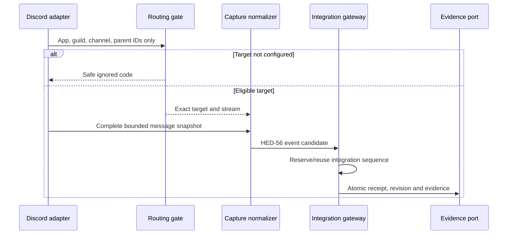
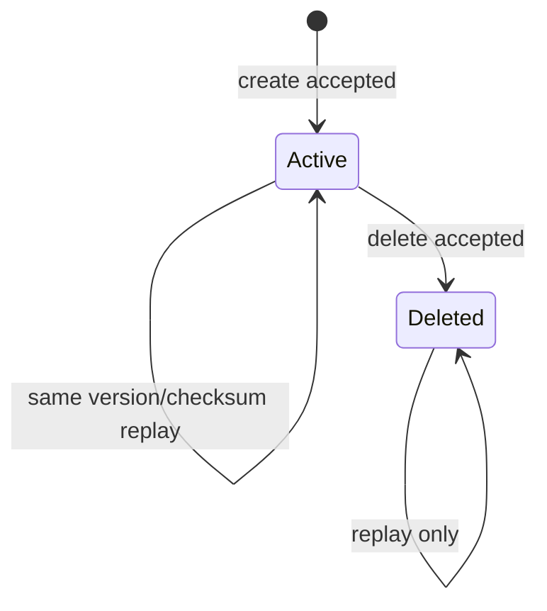
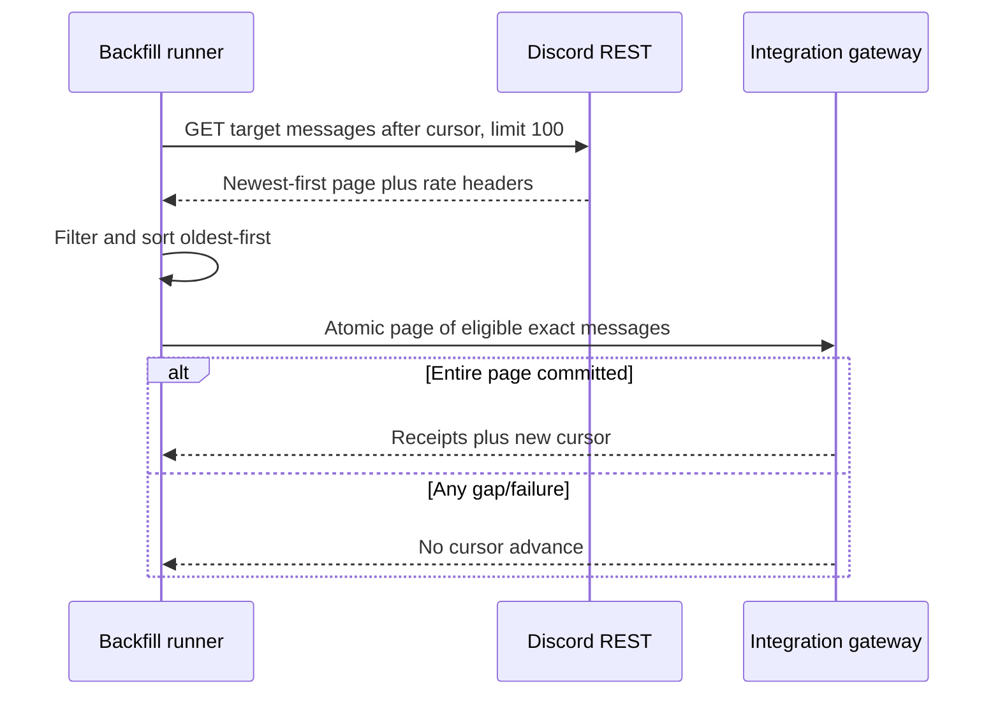

# Opted-in Discord campaign-channel capture

- **Task:** HED-74
- **Status:** executable capture/reconciliation contract; no live Discord connection, storage cutover or deployment
- **Prerequisites:** [`DISCORD_INTEGRATION_ADR.md`](./DISCORD_INTEGRATION_ADR.md), [`INTEGRATION_HUB_CONTRACT.md`](./INTEGRATION_HUB_CONTRACT.md)
- **Executable contract:** `packages/contracts/src/discordCapture.ts`
- **Runtime tests:** `tests/contracts/discord-capture-contract.test.mjs`
- **Provider baseline checked:** Discord API v10 documentation on 2026-08-23

## Frozen behavior

1. Capture is active only for one exact HED-56 connection, workspace, campaign, guild and platform session during an explicit time window.
2. Every eligible text channel or thread is listed separately. Configuring a parent channel does not silently opt every current or future thread into capture.
3. Routing is evaluated before content-bearing parsing. An unconfigured guild/channel/thread produces only a safe ignored code; no message content, attachment name, author or raw provider object reaches evidence, quarantine, logs or storage.
4. Discord `MESSAGE_CREATE`, complete `MESSAGE_UPDATE` and `MESSAGE_DELETE` become immutable HED-56 occurrences. Updates never overwrite earlier evidence. Delete creates lineage/tombstone evidence and invokes the versioned deletion policy separately.
5. Discord Gateway sequence remains resume/provider evidence. The authenticated platform ingress idempotently reserves the contiguous HED-56 integration sequence after the configured-target filter and reuses that reservation on replay.
6. Backfill uses `GET /channels/{id}/messages?after=...&limit=100`, sorts the provider's newest-first response oldest-first, commits a full page atomically and advances the cursor only after every eligible occurrence/receipt is durable.
7. Alpha stores bounded metadata only for reviewed attachments. It never fetches or stores attachment bytes or CDN/proxy URLs. Reviewed image/PDF/text metadata is marked `storedMetadata`; every other media type/oversized attachment is marked `ignoredUnsupported` by transient normalization and excluded from HED-56 evidence.
8. Provider rate limits are learned from `X-RateLimit-*`/`Retry-After`, never hard-coded. A page or event waits/retries at the transport boundary without advancing its cursor or duplicating evidence.

Discord documents that message content/attachments require the `MESSAGE_CONTENT` intent, message history returns newest-to-oldest with mutually exclusive `before`/`after`/`around` and a maximum page size of 100, and `READ_MESSAGE_HISTORY` is required for history ([Message resource](https://docs.discord.com/developers/resources/message)). Message deletes may arrive singly or in bulk ([Gateway message events](https://docs.discord.com/developers/events/gateway-events#message-delete)). Threads expose a parent channel and archived-thread listing has separate permission/pagination rules ([Channel/thread resource](https://docs.discord.com/developers/resources/channel#thread-object)). Rate-limit values remain provider-controlled ([Rate limits](https://docs.discord.com/developers/topics/rate-limits)).

## Two-stage ingress

The adapter must not call the content-bearing decoder, allocate a quarantine payload or construct an evidence object until `resolveDiscordCaptureTarget` returns `eligible`. The routing input is exactly application, guild, channel and optional parent-channel snowflakes. The ignored result contains only one of:

- `CAPTURE_INACTIVE`;
- `OUTSIDE_SESSION_WINDOW`;
- `APPLICATION_MISMATCH`;
- `GUILD_MISMATCH`;
- `TARGET_NOT_CONFIGURED`.

No ignored result echoes provider IDs or arbitrary error/content text.

## Capture scope and thread rules

`hed74-discord-capture-scope-v1` binds:

| Field | Rule |
|---|---|
| tenant scope | Connection/workspace/campaign/guild equal the trusted HED-70 binding. |
| `sessionId` | Exact active platform session; map context must resolve the same session. |
| state/window | `active` or `paused`, canonical `startsAt`, optional exclusive `endsAt`; paused/outside-window input is ignored before content parsing. |
| targets | 1–64 sorted unique channel/thread targets. |
| channel target | `parentChannelId` is null and channel exists in HED-70 configured channels. |
| thread target | Explicit thread ID plus its configured parent channel. The thread inherits the parent's HED-56 stream but remains an independent opt-in target. |
| visibility | Exact `restricted` or `managerOnly`; never public/canon/player DTO. |
| policies | Retention/deletion versions equal HED-70/HED-56. |

Active/public/announcement threads are not auto-discovered for capture. A manager may explicitly add one after the platform verifies its guild/parent. Private threads require explicit membership and remain separately listed; HED-74 does not request `MANAGE_THREADS` or enumerate all private archived threads. Removing a target stops new capture immediately and does not silently delete prior evidence.

## Message schema and normalization

`hed74-discord-capture-message-v1` contains only the normalized subset needed by the product:

- Gateway session/sequence and dispatch;
- trusted adapter source kind (`user`, `bot`, `webhook` or `system`);
- exact application/guild/channel/parent/message IDs;
- supported `default` or `reply` message type and optional reply message ID;
- Discord author ID plus a trusted platform-resolved link reference/version (not a user claim from Discord);
- bounded text, timestamps and metadata-only attachments.

Create/update require `sourceKind=user` and a complete human message snapshot; bot and webhook input fails closed before mapping. Update requires the adapter to merge Discord's partial Gateway update with its cached prior snapshot or a permitted single-message fetch; if a complete snapshot cannot be proven, it is quarantined without altering the revision. Delete requires `sourceKind=system` and carries routing/message identifiers and occurrence time only. Bot, webhook, system content, thread-starter placeholder, forwarded snapshot, poll, call, activity, sticker, embed-only and attachments-only messages are unsupported in this v1 contract.

| Discord fact | HED-56 mapping |
|---|---|
| create | `chat.message.created`, message ID, `created:<timestamp>` version |
| complete edit | `chat.message.updated`, message ID, `edit:<timestamp>` version |
| delete | `chat.message.deleted`, message ID, `delete:<gateway-session>:<gateway-sequence>` version |
| channel/thread | target inherits the configured parent stream; payload retains exact channel/parent IDs |
| author link | trusted opaque link reference/version in restricted payload; HED-56 actor remains the Discord source actor |
| visibility | target's restricted/manager-only classification |

## Attachments

The parser accepts at most ten sorted metadata objects. Fields are attachment ID, safe basename, optional 1024-character description, canonical media type, byte size, optional paired dimensions and disposition. It rejects provider URLs, proxy URLs, byte content, waveform, duration, arbitrary hashes and unknown fields.

Metadata is review-supported only for `image/gif`, `image/jpeg`, `image/png`, `image/webp`, `application/pdf` and `text/plain` at or below 25 MiB. This does not authorize a byte download; it records only that an attachment existed. Every other type/size must be marked `ignoredUnsupported` during transient normalization and is omitted from the persisted HED-56 payload. Attachment-only messages remain unsupported.

## Edit/delete reconciliation and dedupe

`hed74-discord-revision-v1` is a payload-free per-message projection: exact connection/stream/message, last source version/checksum/time, optional deletion time and CAS version.

- same source version and checksum: `idempotentReplay`, no append/cursor move;
- same source version and changed checksum: `idempotencyConflict`, first evidence wins;
- event time not later than the current revision, or any new edit after deletion: `staleRevision`;
- later complete edit/delete: append a new immutable occurrence and increment the revision CAS version.

HED-56 receipt/idempotency remains authoritative for the atomic write. The revision projection is an additional edit/delete guard and contains no content. Bulk delete is expanded into stable single-message delete candidates under one Gateway session/sequence family before integration-sequence reservation; a partial bulk commit is forbidden.

## Backfill

Backfill is manager-initiated, target-specific, bounded by the capture/session policy and independently pausable. It never searches the entire guild.

`hed74-discord-backfill-v1` stores only connection/target, last committed Discord message ID, state, committed-page count, CAS version and time. Its connection must equal the active capture scope. `pending`/`running` cursors plan `after` requests with limit 100. A short committed page becomes `complete`; exactly 100 becomes `running`. Snowflakes are compared as unsigned decimal integers; IDs must be newer than the prior cursor, sorted oldest-first and unique. The cursor cannot be advanced from a response that was not fully normalized, deduped and committed.

For an explicitly configured thread, the same channel-message endpoint and cursor rules apply to the thread ID. Listing archived public threads may help the manager choose a target, but listing does not opt it in. Private archived-thread enumeration requiring `MANAGE_THREADS` is out of scope.

## Rate limits, failure and retry

`hed74-discord-rate-limit-v1` stores only safe scope (`route`, `shared`, `global`), optional bounded bucket ID, provider-derived retry delay, observation time and bounded attempt. Delays above one hour or attempts above ten require operator review instead of an unbounded retry loop.

- 429: honor `Retry-After`/`retry_after`; do not advance backfill/integration cursor;
- 401: stop and rotate/revoke credential, no retry storm;
- 403: pause target and report missing safe permission name;
- 404: stop retrying the deleted/inaccessible message/channel and reconcile deletion only when provider identity/scope is trusted;
- Gateway disconnect: follow HED-70 resume/re-identify behavior, then rely on HED-56 idempotency;
- schema/intent/version drift: quarantine safe metadata and pause affected target.

## Retention and deletion

Captured text and attachment metadata are restricted Discord API evidence encrypted at rest under the connection's retention policy. URLs and bytes are never persisted. Logs, metrics, audit facts, receipts, cursors, revision indexes and rate-limit state remain payload-free.

Discord edit/delete appends lineage; the deletion workflow then applies the connection's deletion policy to eligible raw payload while retaining approved anti-reingestion hashes/tombstones. Removing a target, ending a session or uninstalling the bot stops capture but does not infer permission to erase the campaign or previously approved canon. User/provider deletion requests follow the accessible HED-70 workflow and exact campaign/connection scope.

## Acceptance evidence and exclusions

The runtime suite proves configured channel/thread and active-session filtering, pre-content ignored results, trusted author-link binding, reply/attachment metadata rules, HED-56 create/edit/delete mapping, deterministic reconciliation, after/100/oldest-first backfill cursors, rate-limit bounds and payload-free state.

This task does **not** connect to Discord, request an intent, download attachment bytes, create a Mongo collection/index, expose a production endpoint, capture real messages, run a real backfill, merge or deploy. Those operations require provider credentials, an approved environment and separate implementation/operations gates.
