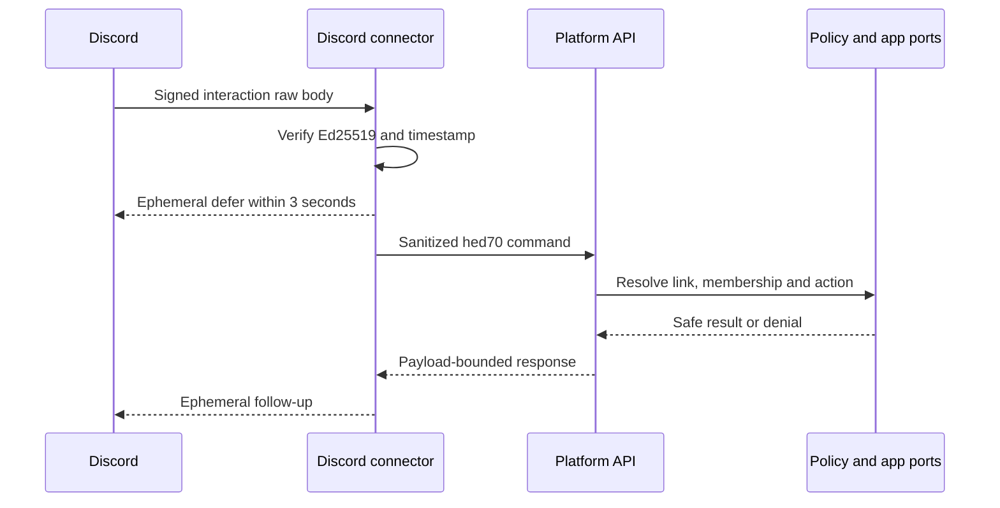
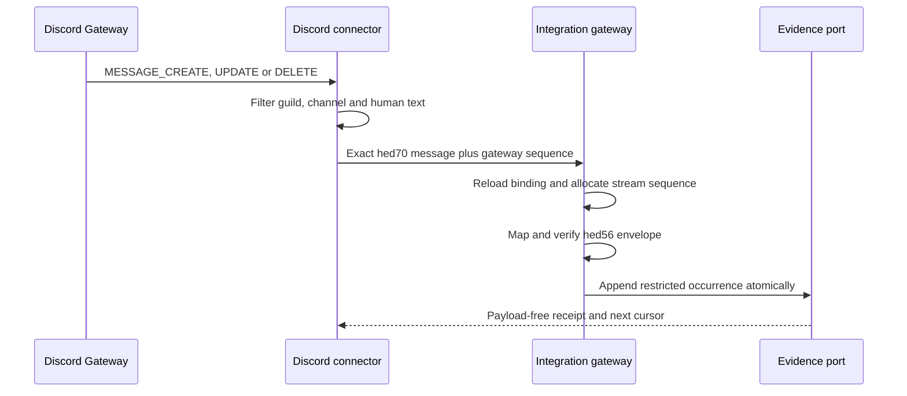
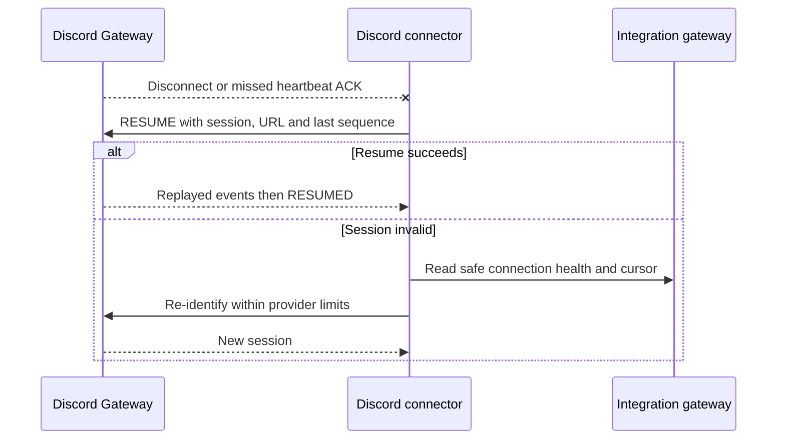
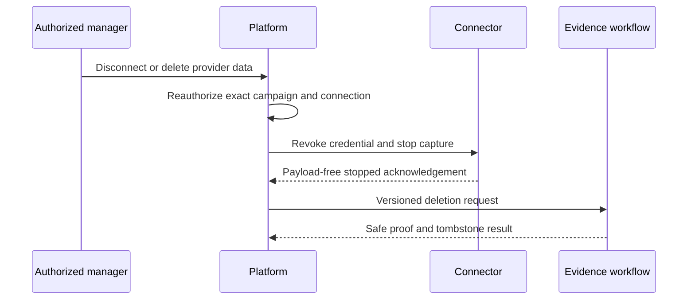

# Discord bot architecture, permissions and data contract

- **ADR:** HED-70
- **Status:** accepted target contract; implementation, real installation and privileged-intent request remain disabled
- **Depends on:** HED-56 Integration Hub envelope, HED-21 campaign policy, HED-18 external connector boundary
- **Executable contract:** `packages/contracts/src/discord.ts`
- **Runtime tests:** `tests/contracts/discord-contract.test.mjs`
- **Channel-capture extension:** [`DISCORD_CHANNEL_CAPTURE.md`](./DISCORD_CHANNEL_CAPTURE.md)
- **Provider baseline checked:** Discord API v10 documentation on 2026-08-23

## Decision

PF2 Party Codex uses one guild-installed Discord application and one external Node.js connector deployable from `apps/discord-bot`. The deployable has two independently stoppable surfaces:

1. a public interaction ingress for application commands over Discord outgoing webhooks;
2. an optional Gateway loop for ambient capture in explicitly configured guild text channels.

The interaction surface is the alpha default and needs no Gateway connection or privileged intent. Ambient channel capture is opt-in and cannot start unless the connection is in `channelCapture` mode and `MESSAGE_CONTENT` is enabled under Discord's current review rules. The no-privileged-intent fallback remains fully usable: slash commands plus the explicit `Capture in Party Codex` message-context command.

The connector is an external client even inside the monorepo. It has no MongoDB URI, collection handle, web session, campaign role or direct evidence/canon write path. It verifies Discord transport, reduces vendor payloads to exact HED-70 schemas and calls a versioned platform HTTPS boundary. The platform reloads the current HED-56 connection and HED-21 human/machine policy before any command or evidence write.

Discord guild roles, channel permissions, command permissions and user IDs are provider evidence only. They never become a PF2 Party Codex workspace membership, owner/GM/player role, user ID or character assignment.

## Provider facts behind the ADR

The following current Discord rules are treated as provider constraints, not copied into authorization logic:

- interactions can arrive either through the Gateway or an outgoing webhook, and those methods are mutually exclusive for interaction delivery; this ADR chooses outgoing webhooks for interactions and reserves the Gateway for message events ([Interactions receiving](https://docs.discord.com/developers/interactions/receiving-and-responding));
- an outgoing interaction request carries `X-Signature-Ed25519` and `X-Signature-Timestamp`; the raw timestamp-plus-body must verify against the application public key, and invalid signatures return 401 ([Interactions security](https://docs.discord.com/developers/interactions/overview#validating-security-request-headers));
- the initial interaction response is due within three seconds and the interaction token is valid for follow-ups for 15 minutes ([Interaction callback](https://docs.discord.com/developers/interactions/receiving-and-responding#interaction-callback));
- `MESSAGE_CONTENT` is privileged. Current review begins after more than 10,000 unique users can see the app across its servers; below that threshold it must still be explicitly enabled in the Developer Portal ([Gateway privileged intents](https://docs.discord.com/developers/events/gateway#privileged-intents));
- without `MESSAGE_CONTENT`, message content is still available for a message selected through a message-context command, which is the deliberate alpha fallback ([Message Content Intent](https://docs.discord.com/developers/events/gateway#message-content-intent));
- REST rate-limit values may change and must be learned from headers rather than hard-coded; a 429 is retried according to `Retry-After`/`retry_after` ([Rate limits](https://docs.discord.com/developers/topics/rate-limits));
- Discord API data must be protected, updated/deleted when required, and exposed through an accessible deletion route ([Developer Terms, data retention](https://support-dev.discord.com/hc/en-us/articles/8562894815383-Discord-Developer-Terms-of-Service#h_01GR1XJ8K2P6J1G9KJ4M6ZC4VJ)).

Provider thresholds and behavior are rechecked before enabling a real app, requesting an intent or changing the data collected. A future provider-policy change requires a new ADR/contract version, not a silent runtime toggle.

## Interaction sequence

Verification happens before JSON parsing or command dispatch. The connector accepts at most 32,768 UTF-8 bytes, lowercase fixed-length signature/public-key hex, and at most five minutes of trusted timestamp skew. Interaction ID deduplication is performed at the platform ingress. The raw body and interaction token are never sent to the platform, persisted, logged, placed in an audit fact or added to a job. A token may exist only in connector memory until its response completes or its 15-minute provider lifetime expires.

Every non-PING command receives an ephemeral defer first. The connector must not wait on policy, MongoDB, AI or a downstream job before acknowledging Discord. A failed platform call becomes a bounded ephemeral failure; it does not retry a mutating command blindly.

## Ambient capture and reconnect sequence

The connector subscribes only to `GUILDS`, `GUILD_MESSAGES` and `MESSAGE_CONTENT`. It ignores DMs, presences, member lists, reactions, typing, voice, bot messages, webhook messages and system messages. Only the allowlisted guild and channel bindings are eligible. The HED-70 base schema captures text and bounded identifiers/timestamps; HED-74 extends it with explicit thread targets, replies and metadata-only attachment policy without adding attachment bytes or URLs.

Discord's Gateway sequence is session-scoped and covers events unrelated to a configured channel. It therefore remains provider evidence in the payload and resume state; it is **not** the HED-56 per-stream cursor. After the guild/channel filter, the authenticated Integration gateway idempotently reserves an `integrationSequence` for the exact stream and provider source identity. A first occurrence receives the next durable sequence; a retry/replay receives its previously reserved sequence so its HED-56 checksum remains stable and does not become a false idempotency conflict. A resume retains the existing Gateway session and provider sequence. A full re-identify starts a new provider session but continues the platform integration stream from its durable receipt/cursor.

Gateway close codes decide resume versus re-identify. Exponential backoff includes jitter and respects `session_start_limit`; repeated identify is never used as a hot retry. If a heartbeat ACK is missed, the connector closes the zombied connection and attempts resume. If a partial `MESSAGE_UPDATE` cannot be merged with a known snapshot or a permitted single-message fetch, it is quarantined rather than converted to empty content. REST fetches honor returned rate-limit buckets and `Retry-After`.

## Installation, scopes, permissions and intents

### OAuth2 scopes

The guild-install URL requests exactly these scopes, in the executable canonical order:

| Scope | Purpose | Decision |
|---|---|---|
| `applications.commands` | Install the approved guild application-command catalog. Discord currently includes it with `bot`; it remains explicit in our contract. | Required |
| `bot` | Add the application bot user to the selected guild. | Required |

No user OAuth access token is required. `identify`, `email`, `guilds`, `guilds.members.read`, `connections`, `webhook.incoming` and all other scopes are prohibited for alpha. The guild ID returned by an install redirect is only a hint; pairing activates only after the platform verifies the installed application/guild through the bot API and binds it to the one-time manager-authorized connection.

### Guild/channel permissions

Permission integers are canonical decimal strings and are calculated with big-integer-safe bit operations. `ADMINISTRATOR` is never requested.

| Permission | Bit | Commands only | Channel capture | Why |
|---|---:|:---:|:---:|---|
| `VIEW_CHANNEL` | 1024 | Yes | Yes | Operate only in explicitly configured visible channels. |
| `SEND_MESSAGES` | 2048 | Yes | Yes | Send bounded bot notices where an interaction response is insufficient. |
| `EMBED_LINKS` | 16384 | Yes | Yes | Render approved recap/status cards; plain-text fallback remains available. |
| `READ_MESSAGE_HISTORY` | 65536 | No | Yes | Resolve an allowed single-message partial edit when it is not in the local cache. No backfill sweep. |
| `MANAGE_MESSAGES`, `MANAGE_CHANNELS`, `MANAGE_GUILD`, `MENTION_EVERYONE`, `ATTACH_FILES` | various | No | No | Not required by alpha. |

- commands-only bitset: `1024 + 2048 + 16384 = 19456`;
- channel-capture bitset: `19456 + 65536 = 84992`.

Channel overwrites may reduce the effective permissions. The health check reports only missing permission names and channel IDs; it never broadens the requested bitset. Commands are guild-only and responses are ephemeral by default. Discord command permissions may hide commands as defense in depth, but the authoritative decision always uses the linked platform user and current exact campaign membership.

### Gateway intents and review gate

| Mode | Gateway intents | Privileged state |
|---|---|---|
| `commandsOnly` | none | `notRequested` |
| `channelCapture` | `GUILDS`, `GUILD_MESSAGES`, `MESSAGE_CONTENT` | `enabledBelowReviewThreshold` or `approved` |

`enabledBelowReviewThreshold` records the current Discord configuration, not a permanent exemption. At or before Discord's current 10,000-visible-user threshold, the owner must submit the provider review and change the state to `approved` before continued capture. A denied, removed or unconfigured intent pauses ambient capture and preserves commands/manual capture. The connector must not reconnect in a loop after Gateway close code 4014.

## Exact connection and transport schemas

`hed70-discord-connection-v1` is a server-owned extension of one trusted `hed56-connection-v1` whose provider is `discord` and whose `externalInstanceId` equals the Discord guild snowflake.

| Field | Rule |
|---|---|
| tenant and provider IDs | `connectionId`, `workspaceId`, `campaignId`, `guildId` must match the trusted HED-56 connection exactly. |
| `applicationId` | Exact Discord application snowflake; never selected from an event. |
| `channels[]` | 1–32 sorted unique `{ channelId, stream }` bindings; each stream is already allowed by HED-56. |
| mode and transport | `commandsOnly` or `channelCapture`; interaction transport is exactly `outgoingWebhook`. |
| scopes/permissions/intents | Exact lists/bitsets from the tables above; extra authority fails parsing. |
| credential/policy versions | Public-key version is a safe server-owned reference. Bot credential, retention and deletion versions must match the trusted HED-56 connection exactly; none contains a secret value. |
| `updatedAt` | Canonical UTC policy/cache invalidation time. |

`hed70-discord-signature-v1` is a payload-free proof returned after Ed25519 verification. Its input is exactly `{ signatureHex, signatureTimestamp, rawBody }`; its output contains only the signed timestamp and trusted verification time. JSON, PING and command handling happen only after this proof succeeds.

`hed70-discord-command-v1` is the only command object forwarded to the platform. It contains exact application/guild/channel/user/interaction snowflakes, the closed command ID, exact command-kind-specific arguments and canonical issue time. It contains no interaction token, raw body, Discord role list, member object, permission claim or signature. The parser adds the required HED-21 policy action and forces an ephemeral response.

`hed70-discord-message-v1` is the complete pre-HED-56 provider event:

| Field | Rule |
|---|---|
| Gateway identity | bounded `gatewaySessionId`, canonical decimal `gatewaySequence`, exact `MESSAGE_CREATE`, `MESSAGE_UPDATE` or `MESSAGE_DELETE`. |
| binding | application, guild and channel must match the trusted connection; message/author values are branded Discord snowflakes. |
| create | human source, author, non-empty bounded text, creation time; occurrence equals creation time. |
| update | a complete merged human text snapshot, author, create/edit times; occurrence equals edit time. Partial raw updates do not cross this boundary. |
| delete | identifiers plus occurrence only; actor/content/create/edit fields are null and source is `system`. |
| exclusions | bot/webhook/system create/update, DMs, unconfigured channels, attachments-only content and unknown fields fail closed. |

`hed70-discord-audit-v1` contains only safe IDs, tenant/guild/channel scope, a closed action/outcome, credential version, trace and time. Exact-key parsing makes message content, raw bodies, interaction tokens, bot tokens and public/private key material structurally impossible.

## HED-56 event mapping

| Discord source | HED-56 type | Source identity/version | HED-56 sequence |
|---|---|---|---|
| `MESSAGE_CREATE` | `chat.message.created` | message ID / `create` | trusted next integration-stream sequence |
| complete `MESSAGE_UPDATE` | `chat.message.updated` | message ID / canonical edit timestamp | trusted next integration-stream sequence |
| `MESSAGE_DELETE` | `chat.message.deleted` | message ID / Gateway session plus sequence | trusted next integration-stream sequence |
| message-context command, unedited target | `chat.message.created` | target message ID / creation timestamp | trusted next integration-stream sequence |
| message-context command, edited target | `chat.message.updated` | target message ID / edit timestamp | trusted next integration-stream sequence |

All mapped payloads are `restricted`; a Discord author ID is an evidence actor reference, not a platform user grant. The platform-supplied event ID, session resolution, receive time, connection and integration sequence are trusted context. The HED-56 parser then rechecks provider, tenant, stream, adapter version, capability, expiry and checksum. Manual message capture additionally requires a trusted successful `discord.command.gm` policy decision.

## Approved alpha command catalog

| Discord command | Internal ID | Policy action | Arguments and behavior |
|---|---|---|---|
| `/codex status` | `codex.status` | `discord.command.player` | No arguments; safe connection/campaign status only. |
| `/codex recap` | `codex.recap` | `discord.command.player` | No arguments; current player-safe approved recap, never raw evidence. |
| `/codex ask` | `codex.ask` | `discord.command.player` | One bounded question; uses the same player-safe retrieval/policy path as web Ask. |
| `/codex capture start` | `codex.capture.start` | `discord.command.gm` | One already-configured channel ID; refuses commands-only mode or an unapproved intent. |
| `/codex capture stop` | `codex.capture.stop` | `discord.command.gm` | One configured channel ID; pauses new ambient evidence without deleting prior records. |
| `Capture in Party Codex` | `codex.message.capture` | `discord.command.gm` | Message-context command; captures the explicitly selected configured-channel text without `MESSAGE_CONTENT`. |

The connector owns the versioned Discord registration manifest; the platform integrations/application ports own command meaning. Global command rollout is not part of alpha because propagation and rollback are slower. Guild commands are registered during pairing/update and reconciled by `hed70-alpha-v1`; unknown/old command IDs fail closed. No prefix/text commands are supported.

## Threat model and controls

| Threat | Boundary control | Safe failure |
|---|---|---|
| Forged interaction or changed body | Ed25519 over exact timestamp plus raw body, fixed-size hex and raw-byte cap. | 401; no JSON parsing or audit payload. |
| Signed replay | Five-minute timestamp allowance plus durable interaction-ID idempotency. | Prior safe response or bounded stale/replay denial. |
| Guild/channel substitution | Application/guild/channel must match the reloaded connection/channel binding. | `BINDING_MISMATCH` or `CHANNEL_NOT_CONFIGURED`. |
| Discord role used as campaign role | Resolve linked platform user and live HED-21 membership; ignore provider roles/permission claims for authority. | Generic ephemeral denial. |
| Cross-campaign manual capture | Configured channel, exact connection tenant and successful GM policy proof are all required. | No HED-56 event is created. |
| Bot/webhook loop | Ambient parser admits only complete human-authored text snapshots. | Event quarantined/dropped with safe count. |
| Partial edit becomes destructive overwrite | Update must be a complete cache-merged or permitted single-fetch snapshot; evidence is immutable/versioned. | Quarantine; prior evidence remains. |
| Intent or permission removed | Health/reconnect checks current mode, review state and effective channel permissions. | Pause ambient capture; commands fallback remains. |
| Bot token/public-key rotation race | Versioned credentials, overlap only for public verification keys, atomic active-version switch, immediate old bot-token revoke. | Connector stops or returns provider-unavailable; no fallback secret. |
| Secret/content leakage | Exact schemas; no raw/token fields in platform command, receipt, audit, job or log. | Redacted safe code plus trace ID. |
| Rate-limit amplification | Bucket-aware scheduling, `Retry-After`, bounded jitter, no blind mutating retry, circuit breaker on invalid credentials/403/404. | `RATE_LIMITED` or provider-unavailable. |
| Disconnect/re-identify loss or duplicate | Gateway resume metadata plus HED-56 idempotency and gateway-assigned durable integration sequence. | Replay is idempotent; unresolved gaps quarantine. |

## Secrets and rotation

| Secret or key | Location and lifetime | Rotation |
|---|---|---|
| Discord bot token | Secret manager injected only into `apps/discord-bot`; never Mongo, browser, platform request or log. | Create/reset provider token, deploy new credential version, verify READY/health, revoke old token immediately; no long dual-token window. |
| Discord interaction public key | Non-secret server config with explicit version; only the connector interaction ingress needs it. | New active version follows provider configuration; bounded previous-public-key overlap is allowed only during a measured cutover. |
| Interaction token | Connector memory only, maximum provider lifetime 15 minutes; never forwarded or persisted. | No rotation; expires or is discarded after response. |
| Platform connector credential | Secret manager in connector, scoped to one connection/campaign and HED-56 capabilities. | HED-56/HED-21 versioned rotation; revoke before acknowledging disconnect. |
| Gateway session/resume URL/sequence | Connector memory or encrypted short-lived connector state, not an authorization credential and never a campaign role. | Discard on invalid session/full re-identify. |

Startup fails closed when a required secret/version is missing or inconsistent. Health output reports versions and safe state, never values. Rotation, pairing, pause, resume, revocation and intent-state changes emit payload-free HED-70 audit facts.

## Retention, deletion and disconnect

Discord raw text is restricted evidence under the HED-56 connection's retention and deletion policy versions. It is encrypted at rest and never copied into logs, audit facts, receipts, cursor records or jobs. Canon/recap/AI consumers receive evidence references and still apply HED-21 policy; Discord capture cannot approve canon.

- message create/update/delete append immutable lineage; a Discord deletion event does not silently remove approved canon;
- a user, guild administrator, campaign manager or Discord request can enter the explicit provider-data deletion workflow; the workflow reauthorizes scope, purges eligible payload, retains only approved anti-reingestion hashes/tombstones and produces proof-grade safe audit metadata;
- disconnect first revokes the integration and connector credential, stops interactions/capture, invalidates caches and then schedules policy-defined deletion if requested;
- uninstall detection pauses/revokes provider access but does not infer authorization to delete the entire campaign;
- no fixed retention duration is selected here; the referenced policy and Discord's current terms control the eventual TTL/migration task.

## Failure behavior and observability

External responses and metrics use only safe codes from the executable allowlist. Signature failures do not distinguish malformed signature from wrong key. Authorization failures do not reveal whether a Discord account is linked or which campaign role is required. Channel/guild health may be shown only to an already authorized campaign manager.

Metrics are counts/latencies keyed by deployment, provider action and safe outcome—not guild, channel, user, message, content, token or arbitrary error text. Traces carry the platform `traceId`; provider IDs appear only in encrypted evidence/connection records or access-controlled audit facts. Unknown Discord fields, command versions, API major versions, intents and event types require explicit compatibility work and quarantine by default.

## Acceptance evidence and exclusions

The executable suite proves:

- exact scope/permission/intent modes and connection/tenant/guild/channel matching;
- Ed25519 callback binding to timestamp plus raw body, skew and size rejection;
- closed alpha commands, command-kind arguments, ephemeral response policy and no transport-secret fields;
- exact create/update/delete mapping to HED-56 with distinct provider and integration sequences;
- bot/webhook/partial/unconfigured event rejection;
- manual message-context capture without `MESSAGE_CONTENT`, gated by the GM policy proof;
- payload-free audit facts and branded Discord identifier separation.

This ADR does **not** install/register a real Discord application, enable/request `MESSAGE_CONTENT`, add a Discord SDK dependency, expose an endpoint, start a Gateway connection, access production/shared MongoDB, create retention indexes, capture real messages, merge or deploy.
