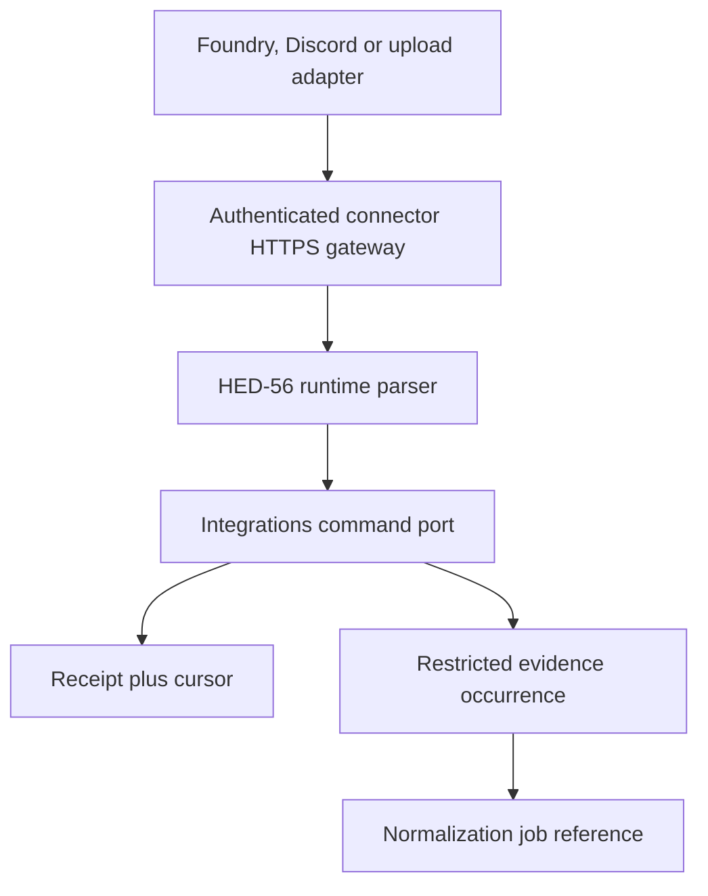

# Integration Hub connection and normalized event contract

- **Task:** HED-56
- **Status:** target external-ingestion contract; no live connector, persistence cutover or deployment
- **Executable contract:** `packages/contracts/src/integrations.ts`
- **Runtime tests:** `tests/contracts/integration-contract.test.mjs`
- **Prerequisites:** HED-18 module/worker boundaries, HED-21 campaign policy and HED-19 evidence/migration ownership

## Frozen decisions

1. An integration connection binds one provider instance to one exact workspace and campaign, and optionally one platform world. A provider, guild, Foundry world or uploaded transcript never selects another tenant at event time.
2. Provider processes remain external clients. They have no Mongo credential, application session, campaign role or direct evidence/canon write path. The authenticated HTTPS adapter reconstructs the trusted connection before parsing an event.
3. Provider input can append restricted evidence only. It cannot create approved canon, grant player visibility, assign a platform user/character identity or make an AI/achievement decision.
4. Every occurrence carries a provider-source identity, decimal stream sequence, canonical semantic checksum and separately derived idempotency key. Retries are safe; same identity with changed semantics is a conflict, not an overwrite.
5. One cursor exists per `{ connectionId, stream }`. It advances with compare-and-swap only after a receipt and immutable evidence occurrence are durable. Gaps and regressions never advance it.
6. Connection and credential revocation are checked on every request. Cached connection health, a valid checksum or a prior successful event cannot authorize a new occurrence.
7. Raw evidence retention, export and deletion are explicit versioned policies on the connection. Disconnecting revokes access; it does not silently erase or republish campaign data.
8. Unknown provider, event type or schema/adapter major version fails closed. A compatibility adapter must produce the exact current envelope before the integrations application port accepts it.

## Trust and data flow

The gateway owns request signature/credential verification, platform event-ID allocation, trusted campaign-session resolution, receive time, size/rate limits and lookup of the current connection. The parser then proves that every claimed event/session/provider/connection/workspace/campaign/world field matches that trusted context. The integrations port owns idempotency and cursor rules. The evidence module owns the immutable evidence record. A bounded same-Mongo unit of work may commit receipt, evidence and cursor through their public ports; the orchestrator receives no collection handles.

No payload or credential is emitted to logs, jobs or internal domain events. The normalization job receives an internal evidence reference and hash under the HED-18 job contract.

## Connection contract

`hed56-connection-v1` is the server-owned connection projection supplied to the event parser.

| Field | Rule |
|---|---|
| `connectionId` | Branded platform ID; never a provider token or installation secret. |
| `provider` | Exact `foundry`, `discord`, `transcript` or `manualImport`. `legacyVault` remains a migration adapter and `aiProposal` is not an integration provider. |
| `workspaceId`, `campaignId`, `worldId` | Exact platform tenant scope. `worldId` may be null for a campaign-level source. |
| `externalInstanceId` | Bounded opaque provider installation/guild/world/upload-source ID. |
| `state` | `pending`, `active`, `paused` or `revoked`; only `active` ingests. |
| `credentialState`, `credentialVersion`, `credentialExpiresAt` | Current HED-21 machine-credential state and rotation/expiry evidence. Both connection and credential must be active and unexpired. |
| `capabilities` | Sorted exact subset of `events:ingest`, `events:replay`, `health:write`. Event acceptance requires `events:ingest`. |
| `allowedStreams` | Non-empty sorted allowlist. An adapter cannot invent a stream after pairing. |
| `adapterVersion` | Exact adapter contract for this connection; version skew is not coerced. |
| policy versions | `retentionPolicyVersion`, `exportPolicyVersion`, `deletionPolicyVersion` are stable server-owned references. |
| lifecycle times | Canonical UTC `createdAt`, `updatedAt`, optional credential expiry and coherent `revokedAt`. A revoked connection also has a revoked credential. |

Pairing is a separate command. It authenticates a human manager under HED-21, verifies the provider instance, consumes a one-time code and creates a credential restricted to this connection/campaign/capability set. Provider roles never become campaign roles.

## Normalized event envelope

`hed56-event-v1` is the only event accepted by the integrations port. Exact-key parsing rejects unreviewed extensions and credential smuggling.

| Field | Rule and authority |
|---|---|
| `eventId` | Branded gateway-allocated platform occurrence ID. It must match trusted verification context, is allocation metadata and is excluded from the semantic checksum. |
| `provider`, `connectionId` | Must match the authenticated connection exactly. |
| `workspaceId`, `campaignId`, `worldId` | Must match the connection exactly. None is trusted as a routing claim by itself. |
| `sessionId` | Optional branded platform session link that must match trusted gateway resolution. A source session identifier remains inside bounded payload/source metadata until separately resolved. |
| `stream` | Stable connection-allowlisted stream; cursor scope is `{ connectionId, stream }`. |
| `sourceDocumentId` | Optional bounded provider document/entity ID used for edit/delete lineage. |
| `sourceEventId`, `sourceEventVersion` | Stable provider occurrence identity plus edit/version discriminator. |
| `sequence` | Canonical non-negative decimal string, up to 40 digits. It is compared as an arbitrary-precision decimal, never coerced to a JavaScript `number`. |
| `occurredAt` | Canonical provider occurrence time; bounded by the trusted evaluation time plus at most five minutes configured clock skew. |
| `receivedAt` | Trusted gateway observation time. The event value must equal the verification context and is excluded from semantic replay identity. |
| `actor`, `speaker` | Provider evidence only: `system`, `user`, `character` or `unknown`, with optional source actor ID/display name; `speaker` may be null. Neither grants internal user/character identity. |
| `type` | Exact v1 event taxonomy listed below. Unknown values require an adapter/schema version change. |
| `visibility` | Raw-evidence classification: `restricted`, `managerOnly` or `participantScoped`. Specific participants are provider actor references, not platform grants. There is deliberately no `public`/canon value. |
| `payload` | Provider-normalized JSON object, maximum 65,536 canonical UTF-8 bytes. Secret-shaped keys are rejected recursively. The payload is restricted evidence, not a DTO for players/jobs/logs. |
| `adapterVersion` | Must equal the active connection adapter version. |
| `traceId`, `causationId` | Safe correlation metadata. Trace ID and trusted receive time are excluded from semantic checksum so retries can correlate independently. |
| `checksum` | Lowercase SHA-256 of the canonical replay-relevant fields. |

### V1 event taxonomy

- chat: `chat.message.created`, `chat.message.updated`, `chat.message.deleted`;
- table play: `roll.created`, `combat.started`, `combat.updated`, `combat.ended`, `scene.activated`, `actor.observed`;
- manual/transcript: `session.note.created`, `transcript.segment.created`, `transcript.segment.updated`, `transcript.segment.deleted`;
- deletion lineage: `source.deleted`.

The executable `INTEGRATION_EVENT_TYPES_BY_PROVIDER` allowlist prevents one credential from spoofing another provider's event family: Foundry owns chat/table-play/source deletion; Discord owns chat/source deletion; transcript owns transcript/source deletion; manual import owns session-note/source deletion. HED-57 maps supported Foundry v14/PF2e hooks to this taxonomy using anonymized fixtures. HED-70 maps Discord gateway/interactions data. Neither task may add an event value silently; it must amend this contract/version and its compatibility tests.

## Canonicalization and idempotency

Object keys are sorted recursively and finite JSON values use deterministic JSON serialization. Lists whose order is semantic retain it; connection capabilities, allowed streams and participant source IDs must arrive sorted and duplicate-free.

The semantic checksum covers:

- schema/provider and exact connection/tenant scope;
- world/session/stream and provider source identity/version;
- sequence and occurrence time;
- actor/speaker, event type, visibility, payload, adapter version and causation.

It excludes allocated `eventId`, trusted observation `receivedAt` and `traceId`. A transport retry may therefore use a new platform event allocation/trace and still prove identical semantics.

The idempotency key is SHA-256 over only provider, exact connection/tenant, stream and provider source document/event/version identity. Schema/adapter versions are deliberately excluded so an upgrade cannot create a second occurrence for the same provider fact; a changed normalized meaning becomes a checksum conflict that requires explicit compatibility handling. Processing follows this order:

1. no prior receipt, valid next sequence: atomically append restricted evidence, create receipt and advance cursor;
2. same idempotency key and checksum: return the prior safe receipt, increment bounded replay evidence, do not append or advance;
3. same idempotency key and different checksum: return `IDEMPOTENCY_CONFLICT`, preserve the first receipt/evidence and quarantine the new claim;
4. changed `sourceEventVersion`: treat as a new immutable occurrence linked to the same source document/event; never mutate old evidence in place.

Receipts store hashes, safe IDs/outcomes and replay count, never payload. An accepted receipt requires an evidence reference. A quarantined receipt requires a safe code and no evidence reference.

## Ordering, gaps, batches and replay

- The cursor owns last sequence/source event/checksum plus an integer CAS version.
- Decimal sequence comparison first compares digit length and then lexical value; leading zeroes and negative/scientific forms are invalid.
- A missing expected sequence returns `SEQUENCE_GAP` with only the expected decimal sequence. It does not accept later events or advance the cursor.
- An unseen sequence below the cursor returns `SEQUENCE_REGRESSION` and is quarantined. A known identity still follows receipt replay/conflict rules.
- A batch transport may contain at most 100 events for one connection and one stream in strictly increasing sequence. Each event is independently checksummed/idempotent; partial prefix acceptance is forbidden. The eventual HTTP batch schema must wrap, not redefine, `hed56-event-v1`.
- Replay requires the separate `events:replay` capability. It submits original identities/checksums through the same parser and receipt path; it never rewinds a cursor or bypasses retention/tombstones.
- Unknown major schema/adapter versions and cursor gaps are quarantined/dead-lettered with safe metadata. They are never loosely parsed or skipped to preserve liveness.

## Revocation, export and deletion

Revocation changes connection and credential state before acknowledging the command, increments credential version, records a safe audit fact and invalidates cached policy/connection projections. Subsequent event, replay and health calls fail even if their request signature was created before revocation. Re-pairing creates or activates a newly reviewed credential version; it does not resurrect an old secret.

Disconnect/revocation does not erase evidence. Data handling is explicit:

- **Export:** a HED-18 `export.build` job receives only the exact campaign/connection scope and policy-filtered evidence references. Connection metadata may be exported; credentials, request signatures and raw cross-provider data may not.
- **Delete:** an idempotent deletion workflow reauthorizes the campaign manager, marks the connection non-ingesting, applies the referenced deletion policy to payload/evidence, and emits redacted audit evidence. Compact receipt/tombstone hashes outlive payload deletion for the approved anti-reingestion window.
- **Provider deletion event:** `source.deleted` appends deletion lineage and schedules policy handling. It does not autonomously delete canon derived from earlier evidence.
- **Campaign/account deletion:** the workflows module coordinates integration revocation and owner-specific erasure through public ports; integrations never infer that removing an app installation authorizes campaign deletion.

Retention TTL/index creation and physical deletion remain operator/migration tasks under HED-19. This contract does not create collections or run cleanup.

## Safe external outcomes

Connector APIs return only bounded status, IDs, retry guidance and these safe codes as applicable:

| Outcome | Meaning |
|---|---|
| `ACCEPTED` | Receipt/evidence/cursor committed. |
| `IDEMPOTENT_REPLAY` | Same identity/checksum; prior safe receipt returned. |
| `IDEMPOTENCY_CONFLICT` | Same identity, different checksum; first result preserved. |
| `SEQUENCE_GAP` / `SEQUENCE_REGRESSION` | Ordering proof failed; cursor unchanged. |
| `CONNECTION_INACTIVE` / `CREDENTIAL_INACTIVE` | Current connection/credential rejected the request. |
| `SCHEMA_UNSUPPORTED` / `ADAPTER_VERSION_MISMATCH` | Explicit compatibility work is required. |
| `EVENT_QUARANTINED` | Input is retained only according to the restricted quarantine policy. |
| `RATE_LIMITED` | Retry only after the bounded server-provided delay. |

Responses never echo payload, credential, signature, provider private content or another receipt. Events confer no authorization to downstream consumers; every sensitive consumer reloads HED-21 policy/current source state.

## Acceptance evidence and exclusions

The runtime suite proves exact connection/tenant/provider/stream/adapter binding, revocation/expiry/capability denial, canonical hash and idempotency separation, gateway time binding, secret/size rejection, restricted participant references, payload-free cursors/receipts and branded ID separation.

This task does **not**:

- create `integrationConnections`, `ingestionCursors`, `ingestionReceipts` or `evidenceRecords` collections/indexes;
- pair a real Foundry/Discord installation, request Discord privileged intents or capture provider hooks;
- start a connector/worker, expose an HTTP endpoint, access MongoDB or enqueue a job;
- import real campaign evidence, select retention durations, run deletion/export, migrate data, merge or deploy;
- permit provider data to write approved canon, player DTOs, achievements or AI results directly.
