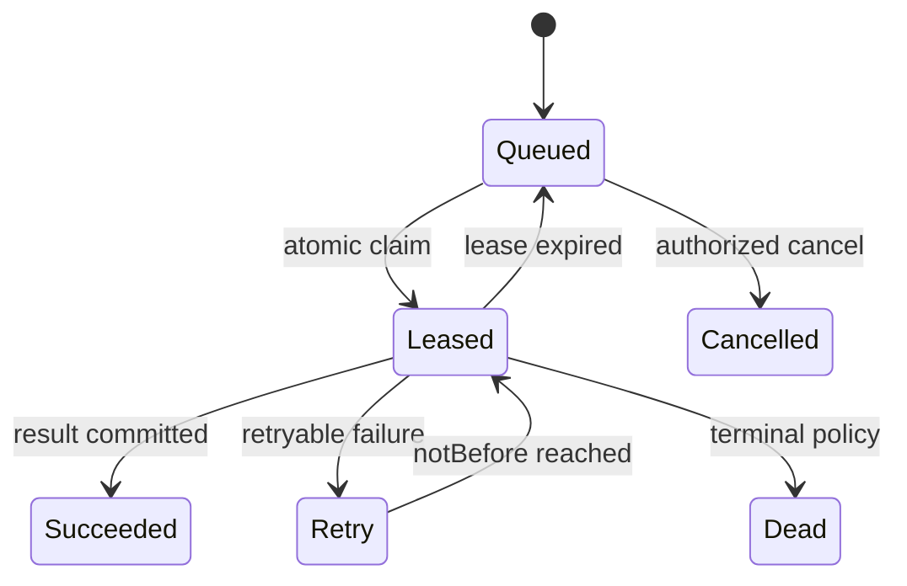

# Modular monolith, data access, jobs, connectors, and deployment boundaries

- **Task:** HED-18
- **Status:** target architecture contract; no runtime cutover, new process, queue, database write or deployment
- **Machine-readable graph:** [`module-boundaries.v1.json`](./module-boundaries.v1.json)
- **Job contract:** `packages/contracts/src/jobs.ts`
- **Integration contract:** [`INTEGRATION_HUB_CONTRACT.md`](./INTEGRATION_HUB_CONTRACT.md) and `packages/contracts/src/integrations.ts`
- **Policy prerequisite:** [`CAMPAIGN_POLICY_PORT.md`](./CAMPAIGN_POLICY_PORT.md)
- **Migration prerequisite:** [`MONGO_MIGRATION_CONTRACT.md`](./MONGO_MIGRATION_CONTRACT.md)

## Frozen decisions

1. The target starts as a modular monolith with independently owned application modules, one Mongo deployment and separately runnable web, worker, compatibility API and operator-command processes. A module is a code/data ownership boundary, not a microservice.
2. Dependencies always point `process -> adapter -> application module public port -> core/contracts`. A domain module never imports a process, framework route, Mongo repository implementation or another module's private code.
3. Every collection has one write owner. Other modules use its command/query ports or consume versioned events; they never write the owner's collection directly.
4. Commands change state and enforce authorization, invariants, concurrency and idempotency. Queries return policy-filtered DTOs/read models and never Mongo documents. Command handlers do not masquerade as queries with hidden writes.
5. Server Components call server-only application query ports directly. Server Functions/Actions call command ports directly after fresh authentication/authorization. Route Handlers are reserved for real HTTP boundaries, not internal fetch hops.
6. Discord and Foundry processes have no Mongo credentials and import no application/Mongo implementation. They call versioned external HTTPS APIs with scoped machine credentials.
7. External effects and long work run through one vendor-neutral job port. The immutable queue envelope contains a payload reference and hash, never the raw provider/content payload or credentials.
8. One worker process family owns queue leases. Interactive web/API processes may enqueue but do not poll, claim or execute jobs.
9. A bounded same-database transaction protects invariants that must become true together. No provider/network call occurs inside it. Long/cross-provider workflows use idempotent steps, an outbox and forward compensation.
10. Raw evidence remains separate from approved canon. AI, integrations, achievements and notifications cannot bypass HED-21 policy or write canon collections directly.
11. Web startup may verify readiness and an approved index version, but does not rewrite domain data. Versioned index and migration operator commands remain separate from serving traffic.
12. The legacy Express/Vite runtime remains the rollback adapter until slice-specific parity and retirement gates pass.

## Repository evidence

| Current behavior | Evidence | Target consequence |
|---|---|---|
| Express startup connects Mongo, ensures indexes, runs an identity backfill, starts the email worker and may start the vault watcher in one process | `apps/server/src/index.js`, `apps/server/src/repositories/identityRepository.js` | Split HTTP, worker, index and migration lifecycles. No data rewrite or background lease ownership in web startup. |
| Routes assemble auth/campaign context and call repositories/services directly | `apps/server/src/routes/*`, `apps/server/src/middleware/*` | Thin adapters construct trusted inputs, call one public application port and map typed results to transport envelopes. |
| Repositories own overlapping domain behavior by file convention rather than an enforced module boundary | `apps/server/src/repositories/*`, `apps/server/src/repositories/collections.js` | Freeze one collection write owner and enforce the target dependency DAG in CI before extraction. |
| Email has a durable Mongo outbox but the web process polls it; a claim can remain `delivering` after a crash | `apps/server/src/services/emailService.js` | Preserve the outbox idea, move execution to worker leases with expiry/heartbeat and explicit recovery. |
| Audit is generally a best-effort service called by routes | `apps/server/src/services/auditLogService.js`, mutation routes | Separate security-critical transactional/outbox facts from best-effort operational analytics. Both are redacted. |
| Onboarding coordinates multiple collections with compensating deletes | `apps/server/src/routes/onboarding.js` | Use a bounded application workflow and same-Mongo unit of work; compensation is forward and idempotent when a provider is involved. |
| Foundry support is batch import/export inside the server and no provider event ledger exists | `apps/server/src/routes/foundry.js`, `apps/server/src/services/foundryImportService.js`, `CURRENT_STATE_AUDIT.md` | External connector APIs terminate in integrations; accepted occurrences append restricted evidence and enqueue normalization. |
| Entitlements, content, visibility, email and audit responsibilities are service-level utilities | `apps/server/src/services/entitlementsService.js`, `campaignContentService.js`, `visibilityService.js`, `emailService.js`, `auditLogService.js` | Move decisions behind module ports; shared utilities cannot become an unowned cross-module write path. |

## Module and collection ownership

The JSON manifest is normative for IDs, dependencies, public port names and collection write ownership. The table explains the boundary. “Owns” includes schema/index approval, repository writes, migrations affecting that collection and its domain invariants.

| Module | Owns | May depend on | Boundary rule |
|---|---|---|---|
| `audit` | Operational `auditLogs` and the security ledger | No domain module | Accepts allowlisted facts. It cannot call back into the source module. Security-critical fact persistence is transactional/outboxed; analytics failure is observable but may be non-blocking. |
| `jobs` | Queue metadata, restricted payload references, executions and generic outbox events | `audit` | Owns enqueue/claim/result state and retry policy registry. It dispatches through worker composition; it never imports a domain handler. |
| `identity` | Users, profiles, web sessions, external identities, reset tokens, invitations and campaign memberships | `audit` | Authenticates principals and owns membership lifecycle. It does not own campaigns or infer role from session data. |
| `entitlements` | Workspace/account entitlements, subscriptions and usage ledger | `identity`, `audit` | Reserves/commits usage through an idempotent port. It never grants campaign membership or content visibility. |
| `campaigns` | Workspaces, campaigns and worlds | `identity`, `entitlements`, `audit` | Owns tenant/world lifecycle. Membership is queried from identity; foreign IDs are opaque branded references. |
| `archive` | Entry heads/revisions/relations, notes, characters, maps/objects, timeline, campaign sessions, handouts and asset metadata | `identity`, `campaigns`, `jobs`, `audit` | Owns approved canon and dedicated archive aggregates. It receives evidence digests/references, never raw evidence payloads. |
| `evidence` | Restricted evidence occurrences and character-knowledge grants | `identity`, `campaigns`, `jobs`, `audit` | Appends immutable evidence, retention decisions and exact-subject knowledge. It may propose, but never approve or write canon. |
| `integrations` | Connections, connector/service credential records, ingestion cursors/receipts and legacy import jobs | `identity`, `campaigns`, `evidence`, `jobs`, `audit` | Authenticates provider and scoped service traffic, applies replay/idempotency rules and advances cursors only after evidence acceptance. It owns no canon. |
| `ai` | Authoring requests/runs and canon proposals | `campaigns`, `archive`, `evidence`, `entitlements`, `jobs`, `audit` | Reads only policy-filtered evidence/canon bundles. Model output is an editable proposal, never an autonomous canon write. |
| `achievements` | Versioned definitions and awards/progress | `campaigns`, `evidence`, `jobs`, `audit` | Hidden definition/criteria remain manager-only. Player projections are separately authorized and title-safe. |
| `notifications` | Notification/email outboxes and delivery records | `identity`, `campaigns`, `archive`, `jobs`, `audit` | Reauthorizes recipient/resource at send time. Deep links and content use allowlisted projections, never cached raw documents. |
| `operations` | Migration runs/items/reports and approved index manifests | Public ports of domain owners plus `jobs` and `audit` | Runs only explicit operator contracts. It coordinates each owner's migration/index adapter and stores control evidence; it never receives a foreign collection handle or serves interactive traffic. |
| `workflows` | No collection | Public ports of required modules | Orchestrates bounded cross-module use cases such as onboarding/export/deletion. No module may depend back on workflows. |

Rules that are not visible from a collection list:

- A module may store another module's branded ID but cannot enforce that module's invariant by reading its collection directly.
- Shared Mongo transactions are opened by a unit-of-work adapter and passed only to participating public command ports. The orchestrator does not receive collection handles.
- Index definitions live with Mongo adapters but the owning module approves their query/invariant purpose. Only the index operator process creates/drops them.
- Object bytes live behind an object-store port; `archive` owns asset identity, campaign scope, audience, hash and lifecycle metadata.
- `workflows` is an application composition root, not a “miscellaneous” service or a place for reusable domain logic.

## Dependency and import rules

Allowed package direction:

| Layer | May import | Forbidden |
|---|---|---|
| `packages/contracts` | Language/runtime validation helpers only | Core, application modules, Mongo, frameworks, UI, provider SDKs, PF2 rules |
| `packages/core` | Contracts | Application modules, Mongo, Next/Express, queues, React, provider SDKs, browser globals |
| `packages/application/<module>` | Contracts, core, the listed public ports of upstream modules | Another module's repository/private handler; Mongo/Next/Express/React/provider SDK |
| `packages/mongo/<module>` | Its application ports/contracts, Mongo driver | Routes/UI, another module's private adapter, raw provider SDK |
| `packages/integrations/<provider>` | Contracts and narrow application ports | Core authorization replacement, direct collection handles, browser UI |
| `apps/web-next` server-only code | Contracts and application composition ports | Mongo document access in components, client import of server modules |
| `apps/worker` | Job dispatcher plus application composition ports/adapters | Next route code, React, interactive request/session objects |
| connector apps/modules | Generated/versioned external API contracts | Mongo, platform repositories, internal application implementation |

Enforcement gates:

1. The machine-readable graph must remain acyclic; collection owners and public port names are unique.
2. Static import tests scan nested source modules, not only package entrypoints.
3. Each application package exposes a single `public.ts`/package export surface; private folders are not exported.
4. TypeScript project references mirror the manifest direction. A build cannot rely on path aliases that bypass package exports.
5. No barrel file may re-export Mongo documents or private handlers into a public application surface.
6. A new dependency edge requires a manifest/doc change and architecture review; “temporary” reverse imports are forbidden.

## Command, query, and event boundaries

### Commands

A command is named as one business action and contains:

- schema/command version, command ID, exact workspace/campaign or account scope;
- authenticated principal/machine reference reconstructed by the adapter;
- idempotency key and canonical request hash when retry is plausible;
- expected aggregate version/concurrency token when updating existing state;
- policy version and safe trace/causation IDs;
- validated business input, never a framework request or Mongo document.

The handler reloads current authorization state, applies HED-21, checks invariants and commits one result. It returns stable IDs, versions, safe outcome codes and an allowlisted DTO only when the caller needs one. Client-supplied owner, role, grants, price/budget, provider scope, evidence visibility or audit actor never becomes authority.

### Queries

A query contains the exact scope, viewer/machine subject and a bounded filter/cursor. The application policy creates a storage-neutral read scope; the Mongo adapter converts every dimension into predicates before selection. A serializer then constructs the manager, player or dedicated-machine DTO. Query ports:

- cannot return Mongo documents, unrestricted metadata or raw evidence by default;
- cannot trigger imports, repairs, cursor advancement, audit backfills or lazy writes;
- use opaque signed/versioned cursors bound to tenant, filter and audience;
- cache only under the exact HED-21 tenant/subject/operation/resource discriminator.

### Events

Events are immutable facts emitted after a successful command. They carry schema version, event ID, aggregate ID/version, exact tenant, safe fact fields, trace/causation IDs and occurrence time. They do not carry raw evidence, credentials, complete canon bodies, email bodies or model prompts. Consumers are idempotent on `{ consumer, eventId }`.

Events do not grant authority. A notification, AI, achievement or connector consumer reloads current policy/source state before any sensitive effect. Version skew is handled by explicit adapters; unknown major versions are quarantined/dead-lettered, not loosely parsed.

## Shared schema rules

- `packages/contracts` owns network/job/event/DTO shapes and runtime parsing; TypeScript types alone do not validate external or Mongo data.
- Core types express domain invariants after parsing. Storage adapters map versioned Mongo documents into core types and reject/quarantine incompatible data.
- Every external schema uses an explicit immutable version. Additive optional fields require safe defaults; semantic changes require a new version and compatibility adapter.
- Branded workspace/campaign/user/entry/character IDs remain distinct across module ports. Foreign IDs are opaque; loose string coercion does not authorize cross-tenant access.
- Canonical time, finite JSON/Extended JSON and legacy anomaly handling follow HED-19. No module invents a second coercion policy.
- Player/machine DTOs are positive allowlists. Unknown fields never “pass through” a generic mapper.
- Raw provider payloads, secrets, tokens and private content are referenced by safe IDs/digests across module/job/event boundaries, not copied.
- Generated API clients may depend on external contracts only. They do not expose internal command handlers or Mongo schemas.

## Next.js server data-access boundary

| Caller | Correct path | Forbidden path |
|---|---|---|
| Server Component/layout/page | Authenticate and call a server-only application query/composition port directly | Fetching the app's own Route Handler, importing Mongo in presentation code, or passing raw records to a Client Component |
| Server Function/Action | Re-authenticate, validate input/CSRF-origin assumptions, call one command port, then invalidate the exact cache scope | Trusting that a rendered form proves authorization; importing a repository directly |
| Route Handler | Treat as a public API: authenticate machine/human, rate/size limit, runtime-parse, call a port, return a versioned envelope | Reusing browser UI guards as authorization or becoming a second domain implementation |
| Client Component | Receive the minimum serializable DTO and invoke an approved Action/API | Importing `server-only`, application, Mongo, credentials or policy internals |

Route Handlers are required for connector/webhook endpoints, compatibility/public APIs, downloads/streams and clients that cannot call Server Functions. Server Components should read directly from their server-side source through the data-access/application layer instead of making an internal HTTP round trip. Every Action and Route Handler independently authenticates and authorizes; layout or middleware checks are only an early redirect/optimization.

Server-only entrypoints use a `server-only` guard and package exports that have no client-compatible path. Cache/revalidation ownership stays in the web adapter; domain modules return versions/events and do not import Next cache APIs.

## Discord and Foundry external API boundary

The Discord bot and Foundry module are external clients even when they live in the monorepo.

The Discord-specific runtime, least-privilege installation, interaction signature, command, Gateway-message and HED-56 mapping decisions are frozen in [`DISCORD_INTEGRATION_ADR.md`](./DISCORD_INTEGRATION_ADR.md).

- They receive no Mongo URI, application session secret, object-store master credential or internal service credential.
- They import only generated/versioned connector request/response contracts and provider SDK/types.
- Foundry sends outbound HTTPS batches; the platform never opens an inbound port to a World or remotely controls Foundry.
- Discord gateway events/commands are normalized locally, then sent to a bounded platform endpoint. Discord roles never map directly to campaign roles.
- Pairing exchanges a one-time code for an exact provider/instance/campaign credential. Revocation/version/capabilities are checked on every request.
- Requests are signed/authenticated, timestamp/nonce bounded, size/rate limited and idempotent. The receiving Route Handler calls integrations; it does not write evidence/canon itself.
- Accepted provider input appends restricted raw evidence or an import proposal. Unknown visibility defaults restricted; canon approval remains a separate manager command.
- Responses expose health, receipt/retry status and safe diagnostics only. They never return raw other-provider evidence or a generic GM session.

## Job and queue contract

`parseJobCommandRequest` accepts only an immutable, secret-free envelope and a trusted enqueue context:

- exact job type, producer and account/campaign scope;
- `jobId`, idempotency key, policy/retry-policy versions and a canonical request hash;
- restricted `payloadRef` plus lowercase SHA-256 `payloadHash`;
- canonical enqueue/not-before time and safe trace/causation IDs.

The trusted enqueue context names the authenticated platform producer and server evaluation instant and supplies the SHA-256 implementation. The parser rejects a producer claim that differs from that adapter, an enqueue time in the trusted future or a caller request hash that does not match canonical UTF-8 bytes. The canonical request hash includes schema version, job type, producer, exact scope, payload reference/hash, idempotency key, policy version, retry-policy version, `notBefore` and causation ID. It deliberately excludes allocated `jobId`, enqueue-observation time and trace ID so a same-key semantic replay can return the original job/result; changing any executable policy, payload, scope or schedule field is a hash conflict. The execution parser reloads both the immutable command and the current active lease from trusted queue state, re-verifies the command hash, and binds the report to the exact job ID, type, tenant scope, payload hash, `notBefore`, worker ID, lease version, attempt and lease-token hash. The claim must follow `notBefore`, execution must follow the claim, completion cannot be later than the trusted result-evaluation instant, and that evaluation must occur strictly before lease expiry. A stale worker report therefore fails after reclaim even when it finished under an earlier lease.

Campaign work always carries exact workspace and campaign. Only `email.deliver` may use account scope; campaign email may still use campaign scope. Max attempts, backoff, timeout, concurrency partition and kill switch are trusted server-side registry values identified by `retryPolicyVersion`, never caller-controlled envelope fields.

The producer value names the trusted platform adapter that created the job after transport authentication (`web`, `legacyApi`, `discordApi`, `foundryApi` or a prior `worker` step). It is not accepted from an external connector claim.

| Job type | Owner/handler | Required special gate |
|---|---|---|
| `email.deliver` | Notifications | Account/campaign recipient resolution, current suppression/consent and provider idempotency |
| `import.commit` | Integrations + archive workflow | Approved immutable import manifest and HED-19-compatible idempotency |
| `evidence.normalize` | Evidence/integration adapter | Exact connection/receipt, visibility mapping and immutable event lineage |
| `evidence.retention` | Evidence | Authorized retention policy/hold and no canon cascade |
| `canon.propose` | AI/archive proposal path | Evidence bundle digest and manager approval remains separate |
| `ai.author` | AI | Current policy-filtered bundle, entitlement reservation, model/budget kill switch |
| `achievement.evaluate` | Achievements | Exact subject/evidence IDs; hidden definition never copied to player output |
| `notification.deliver` | Notifications | Reauthorize recipient and resource at send time |
| `export.build` | Archive/workflow | Exact party/GM export policy, expiring object-store artifact |
| `projection.rebuild` | Archive | Versioned derivation, exact campaign, shadow comparison before publish |

The queue stores metadata separately from restricted payload bytes. Logs, metrics, dead-letter listings and user-visible reports contain references/hashes, aggregate counts and safe codes only.

### Lease lifecycle

Lease and retry rules:

1. Claim atomically matches queued/retry state, `notBefore <= now` and absent/expired lease; it increments `leaseVersion` and attempt.
2. Only the worker receives the opaque lease token. Heartbeat/result updates match job ID, worker ID, lease version and token hash.
3. An expired lease may be reclaimed. Therefore handlers must use the envelope idempotency key and request hash; lease uniqueness alone is not effect uniqueness.
4. Same `{ jobType, scope, idempotencyKey }` plus the same request hash returns the prior job/result. A different hash is a conflict.
5. A provider call uses a stable provider idempotency key derived from the job/effect, then persists the provider receipt before acknowledging success.
6. Retry uses server registry classification and bounded jittered backoff. Unknown/unparseable/provider-auth errors are terminal or quarantined according to the versioned policy.
7. Dead-letter records keep safe code, payload hash/reference and attempt facts, never payload bytes or provider response bodies.
8. Cancellation is cooperative. A running non-cancellable external effect may finish; the handler records the fact and suppresses only safe downstream steps.

`parseJobExecutionReport` enforces active-lease compare-and-swap proof, coherent success/replay/retry/failure/cancel states, canonical time ordering, a strictly future retry instant, paired output reference/hash and stable safe error codes. It cannot contain a raw lease token, raw output or error detail.

## Transactions, idempotency, and outbox strategy

Use a Mongo transaction when all of these are true:

- the invariant spans a bounded set of documents in the same deployment;
- the operation has no provider/network/model/object-store call;
- the transaction can use indexed predicates and finish quickly;
- the deployment mode has been verified in disposable integration tests.

Examples include campaign + owner membership onboarding, entry head + immutable revision + outbox fact, idempotency receipt + first domain effect, and usage reservation + authoring request. The application unit of work calls owning module ports; it does not mutate foreign collections itself.

Use an idempotent saga/job when work includes providers, large batches, retries, long computation or separately deployed effects. Each step records a stable command ID, request hash, status, output reference/hash and compensating/forward-repair action. Compensation never erases approved canon or hides an irreversible provider effect.

The transactional outbox is written with the domain change. A worker claims and publishes it. Consumer receipts make delivery at-least-once and effects idempotent. “Exactly once” is not promised across network boundaries.

Concurrency rules:

- aggregate updates compare `version`/expected revision;
- cursor/lease/usage updates use compare-and-swap;
- unique partial/compound indexes enforce stable identity only where null/missing semantics have been proven;
- cross-module events include aggregate version; consumers ignore older duplicates and quarantine impossible gaps;
- idempotency receipts outlive raw evidence/payload long enough to prevent replay after TTL cleanup.

## Deployment process map

| Process | Inbound | May do | Must not do | Readiness/rollback |
|---|---|---|---|---|
| `web-next` | Browser HTTP | Server rendering, Actions, public Route Handlers, enqueue jobs, call application ports through composition | Poll queue, run migrations/index changes, expose Mongo docs, embed provider workers | HTTP health plus dependency readiness; slice flags route back to legacy |
| `legacy-api` | Compatibility HTTP | Serve unchanged Express contracts through adapters during migration | Become a second writer after its slice cutline; start new background loops | Immutable legacy image and per-route rollback |
| `worker` | Queue leases/outbox | Run allowlisted handlers, heartbeats, retries, provider effects and projections | Serve interactive UI/API, trust stale session role, import Next routes | Queue/Mongo/provider readiness; drain leases before rollback |
| `discord-bot` | Discord gateway/interactions | Normalize commands/events and call connector HTTPS API | Mongo/internal module access or user/GM impersonation | Connection health; revoke credential/stop process independently |
| `foundry-module` | Foundry hooks/UI | Outbound signed batching, local setting/pairing UI | Inbound remote-control port, Mongo/internal application access | Disable per World/revoke connection; no platform data rollback needed |
| `migration-command` | Explicit operator command | Call the `operations` port for HED-19 inventory/dry-run/commit/verify/routing rollback through approved owner adapters | Serve traffic, claim jobs, receive general-purpose collection handles or bypass manifest/backup confirmations | Exact report/manifest/restore reference; data preserved on route rollback |
| `index-command` | Explicit operator command | Call the `operations` port to apply/verify one approved owner-signed index manifest | Backfill/rewrite domain documents, receive general-purpose collection handles or run at every request startup | Disposable rehearsal, pre/post verification and separate rollback plan |

Initially these processes may share one image/codebase, but their entrypoints, credentials, readiness, scaling and shutdown are separate. Web and worker do not share an in-memory singleton, timer or queue. A future service extraction may replace a public port with transport only after metrics/scale/failure isolation justify it; collection ownership and contracts remain unchanged.

The machine-readable manifest grants processes exact qualified command/query ports, never whole modules. In particular, web and legacy API receive only `jobs.enqueueJob`, `jobs.cancelJob` and `jobs.getJobStatus`; only the worker receives `jobs.claimJobLease`, `jobs.recordJobResult` and `jobs.listDeadLetterJobs`. Adding a new module port grants it to no process until this manifest and its boundary tests are explicitly updated.

## Observability and audit

Every request/command/job/event carries safe request/trace/causation plus exact campaign and aggregate/job IDs where applicable. Record:

- policy result code/version without private content;
- command duration/outcome, conflicts and idempotent replays;
- query latency/count and serializer version, not titles/bodies/raw filters;
- queue depth/age, lease expiry/reclaim, attempts, retry/dead-letter codes;
- connector receipt/gap/cursor health and credential version, not credentials/payload;
- outbox lag/consumer replay and provider outcome code;
- transaction abort/unknown-commit handling;
- deployment/version/readiness and compatibility diff metrics.

Logs and metrics never contain tokens, pairing/user codes, email bodies/addresses where avoidable, raw evidence, GM content, prompts/model responses, blind/secret results or credential-shaped metadata. Per-item restricted diagnostics remain in an authorized evidence/operations record with retention, not general logs.

## Adoption and rollback sequence

1. Keep the manifest and contract tests green while extracting package shells; no module moves data yet.
2. Create public application ports and wrap current repositories one slice at a time. The wrapper remains the only write adapter for that collection.
3. Add Mongo adapters under the owner module and compare current/target queries/DTOs in shadow mode.
4. Move the email loop first to the worker lease model on disposable/staging data; web stops polling only after worker readiness and recovery drills pass.
5. Add external connector APIs only after identity/pairing, integrations/evidence and job boundaries exist.
6. Apply HED-19 data migration/cutline per collection. One writer remains active at every stage.
7. Roll back the route/writer/process entrypoint, preserve new data/outbox/job evidence and forward-repair. Do not delete a target collection as routine rollback.
8. Remove a compatibility adapter only after zero required callers, elapsed rollback window, verified backup and an explicit retirement task.

## Verification gates

- machine-readable module graph parses, is acyclic and names every dependency;
- each current HED-19 collection and each target control collection has one write owner; workflows own no collection;
- external connector processes have no Mongo/module access; exact port grants keep claim/result/dead-letter control worker-only;
- strict job command/report parsers reject raw/extra fields, malformed tenant/time/hash, caller retry limits and incoherent result states;
- static imports match the graph and recursively inspect nested files;
- command/query integration tests prove no foreign collection write and no hidden query mutation;
- disposable Mongo tests prove transaction retry, unknown commit handling, idempotency conflict, lease expiry/reclaim and outbox replay;
- web tests prove Server Components/Actions use server-only application ports and Route Handlers reauthorize as public APIs;
- connector tests prove signature/replay/size/rate/tenant denial and no Mongo credential in build/runtime config;
- player/machine DTO tests reuse HED-21 and HED-24 adversarial assertions;
- migration/index commands reuse HED-19 safety gates and never run against production first;
- process shutdown tests drain HTTP and leases independently.

## Deferred implementation

This contract does not add Next.js, create application/Mongo/integration packages, introduce a queue vendor, create queue/module collections, move the email worker, run an index/migration, enable Discord/Foundry/AI, change current Express routes, access production/shared data, merge or deploy. Vendor choices for queue, auth, object storage, email and AI remain replaceable behind these ports.

## References

- [Next.js Backend for Frontend guide](https://nextjs.org/docs/app/guides/backend-for-frontend)
- [Next.js Data Security guide](https://nextjs.org/docs/app/guides/data-security)
- [Next.js Authentication guide](https://nextjs.org/docs/app/guides/authentication)
- [Next.js Mutating Data guide](https://nextjs.org/docs/app/getting-started/mutating-data)
- [Next.js Route Handlers](https://nextjs.org/docs/app/getting-started/route-handlers)
