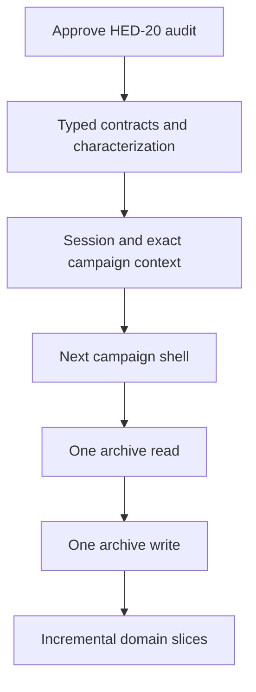

# Gated Next.js migration sequence

- **Input:** HED-20 audit of `origin/main@372f88fc070313c351ddce830647c355db8a39b7`
- **Status:** proposed contract; implementation is blocked until human review of the HED-20 audit
- **Target:** Next.js App Router, strict TypeScript, MongoDB source of truth, system-neutral archive core

## Stop condition

Do **not** create a Next.js application, change runtime code, install migration dependencies, run a database migration, or merge draft PR #33 as part of HED-20. Review and approve or amend:

1. the current-state findings;
2. the reuse/adapt/rewrite/retire decisions;
3. the canonical archive ownership proposal;
4. the visibility/session transition contracts;
5. the exact next task at the end of this document.

Until then, the audited Express/Vite application is the only implementation and rollback baseline.

## Sequence summary

The first vertical slice is intentionally thin but end to end. It starts with contracts because the current auth, visibility, and archive DTOs are implicit. It ends only when a GM can read and edit one archive entry and a player can read the player-safe form through server-verified campaign context, with a tested rollback to the legacy implementation.

## Proposed target boundaries

| Boundary | Owns | Must not own |
|---|---|---|
| `packages/contracts` | Branded IDs, runtime input/output schemas, DTOs, error codes, compatibility fixtures | Express/Next handlers, Mongo queries, React components |
| `packages/core` | System-neutral entities, publication/audience policy, domain invariants | HTTP, cookies, localStorage, Mongo driver, PF2 rules |
| `packages/application` | Auth/campaign/archive use cases and ports | Framework request objects, database documents, JSX |
| `packages/mongo` | Mongo document mapping, scoped queries, indexes, versioned migrations | Browser DTOs, route selection, PF2 UI |
| `packages/integrations` | Markdown, Foundry, Pathbuilder/PF2e, email, object storage, future event/AI adapters | Core authorization decisions |
| legacy `apps/server` | Compatibility API and rollback runtime during migration | New domain policy once a typed application port exists |
| future `apps/web-next` | App Router layouts, server-side view models, client interaction islands | Duplicate authorization or direct Mongo access from UI |
| future `apps/worker` | Outbox/import/event jobs with leases and idempotency | Interactive web requests |

These package names may be adjusted during review; their dependency direction may not. Core/application packages cannot import Next, Express, Mongo, React, or PF2-specific implementations.

## Contract decisions required before implementation

### 1. Canonical archive ownership

Recommended model, subject to review:

- `entries` is canonical for narrative archive documents such as lore, NPCs, locations, quests, and recaps.
- `maps`/`mapObjects`, `timelineEvents`, `sessions`, `handouts`, `notes`, and `characters` remain canonical dedicated aggregates because their behavior and visibility are structurally different and the architecture contract names them explicitly.
- Campaign Archive is a product/read-model boundary across those aggregates; it is not a requirement to duplicate every aggregate as an `entry`.
- An entry can link to a dedicated aggregate through a typed relation/projection. It does not become a second writable copy.
- `entryRelations` becomes the persisted relation projection with an explicit rebuild command. Normal writes/imports update it; reads do not invent a separate transient truth.
- Existing map/timeline/session-shaped entries are legacy records until a measured migration classifies them. `routes/archive.js` fallback behavior remains compatibility-only.

Approval questions:

1. Are dedicated aggregates canonical, or should any be folded into entries?
2. Which existing records are duplicates versus narrative pages about the same object?
3. What stable ID and relation type connects an entry to a dedicated aggregate?
4. Are archive counts aggregate counts, narrative-entry counts, or both as separate named metrics?

No data migration can be designed until those questions are answered with representative database counts and samples.

### 2. Visibility policy

Do not replace all current values with one enum. Recommended normalized policy:

| Dimension | Candidate values | Purpose |
|---|---|---|
| Editorial state | `draft`, `needsReview`, `active`, `archived` | Whether content is ready/current. |
| Audience | `gmOnly`, `party`, `specificPlayers` | Who may receive the resource. |
| Release state | `hidden`, `public`, `revealed` | Product meaning and notification/history behavior for party content. |
| Ownership grants | author, assigned player, GM share, explicit user IDs | Resource-specific access for notes/characters/handouts. |

Compatibility mapping must be explicit and reversible. For example, an entry `public` maps to active/party/public; `revealed` maps to active/party/revealed; `needsReview` maps to needsReview and no player audience. Note and character policies require ownership grants rather than lossy conversion into an entry enum.

The policy package must produce both:

- Mongo predicates that avoid selecting unauthorized records; and
- allowlisted response serializers that ensure nested GM fields never enter player JSON.

### 3. Session transition

Recommended transition, subject to security review:

1. Keep the existing Bearer verifier only as a compatibility input to Express.
2. Add an authenticated exchange/login response that establishes an HttpOnly, Secure-in-production, SameSite cookie with rotation and explicit expiry.
3. Produce one `SessionPrincipal` contract containing user ID, session version, platform capabilities, and no campaign role.
4. Resolve campaign role from an exact route `campaignId` on every protected campaign operation.
5. Keep `X-Campaign-Id` only for legacy clients while Next uses route identity; reject disagreement rather than silently switching tenant.
6. Add CSRF protection appropriate to cookie-authenticated mutations.
7. Do not expose cookie contents or legacy tokens to Client Components.

No auth framework/provider is selected by this document. The acceptance contract comes before that choice.

## Gated phases

| Phase | Scope | Required evidence / exit gate | Rollback |
|---|---|---|---|
| 0. Baseline acceptance | Review HED-20; install lockfile dependencies in an approved environment; run current checks. | Recorded `npm ci`, tests, Vite build, syntax, and dependency-audit results on audited SHA. Pre-existing failures have owners/accepted disposition. | No code change. |
| 1. Contract extraction | Add strict TS configuration and framework-free contracts/core packages. Encode identity, workspace, campaign, membership, visibility, archive entry, errors, and compatibility schemas. | Typecheck; runtime schema tests; existing JSON fixtures accepted/rejected as expected; no production routing or data writes changed. | Remove new packages; legacy runtime is untouched. |
| 2. Repository characterization | Add disposable-Mongo integration tests around exact campaign context, role denial, player-safe serialization, archive read/write, invitation trust, and current dual archive reads. | Access matrix is executable for owner/GM/player/non-member/removed member; no secrets in player snapshots; current inconsistencies are named, not normalized invisibly. | Tests only; no cutover. |
| 3. Session compatibility | Implement the approved principal/cookie gateway and typed campaign-context adapter while preserving legacy Bearer clients. | Login/logout/reset/revoke, cookie flags/expiry/rotation, CSRF, header/route disagreement, and cross-campaign denial tests pass. | Feature flag or route rollback to Bearer-only Express; invalidate new cookies. |
| 4. Next foundation | Scaffold `apps/web-next` only after phases 0-3. Add root layouts, error/loading boundaries, observability, config, and CI strict checks. No broad screen port. | Production build, smoke route, CSP/security headers, typed env, and deploy preview pass. No Mongo access from presentation code. | Do not route production traffic to the app. |
| 5. Campaign shell | Authenticated route and `/campaigns/[campaignId]` layout with GM/player navigation from server-verified context. | Owner/GM/player screenshots and accessibility checks; non-member/removed-member fail closed; campaign switching does not leak cached data. | Legacy campaign links remain primary; new shell behind flag/path. |
| 6. One archive read | Port one narrative entry detail read through contracts/application/repository into server-rendered GM and player views. | Same approved record yields GM full DTO and player-safe DTO; not-found vs forbidden policy is intentional; parity fixture and performance budget pass. | Per-route feature flag sends users to legacy page. |
| 7. One archive write | Port create/update of that narrative entry for GM only with validation, optimistic concurrency/idempotency, visibility state, relations, and audit fact. | GM success/conflict/validation tests; player denied; no partial write; legacy client can read result; rollback path documented. | Disable new mutation and continue editing through legacy API; data format remains backward compatible. |
| 8. Archive expansion | Search/categories/list, relations, then dedicated aggregates one at a time according to approved ownership. | Each slice has access matrix, parity, migration/reconciliation metrics, E2E, and route rollback. | Slice-specific flag and legacy route. |
| 9. Player and GM modules | Notes, handouts, character dossier, maps/timeline, players/invites; polish after data flow is stable. | Product and security acceptance per module. No full builder/session runner required. | Legacy module remains until explicit retirement. |
| 10. Operations and admin | Object storage, worker, imports/exports, minimal platform admin, entitlements/billing adapter. | Backups/restores, job idempotency, retention, audit, provider sandbox, and failure drills. | Provider adapters and legacy outbox/export remain switchable. |
| 11. Retirement | Remove legacy routes, vault runtime, Vite shell, and CSS layers only after traffic/data evidence. | Zero required callers, stable error/security metrics, rollback window elapsed, archive/asset reconciliation complete. | Retain immutable legacy release and database backup for the approved window. |

## First vertical slice acceptance matrix

The first slice is complete only when all cells below are automated. A visual page alone is not a slice.

| Actor/state | Campaign shell | Archive read | Archive write |
|---|---|---|---|
| Owner | Sees GM navigation for exact campaign | Receives public and GM content | Allowed with valid concurrency token |
| GM | Sees GM navigation for exact campaign | Receives public and GM content | Allowed with valid concurrency token |
| Player | Sees player navigation | Receives only active player-authorized fields; no GM/source-private data in payload | Denied on backend |
| Non-member | No campaign context | Not found/forbidden according to approved enumeration policy | Denied on backend |
| Removed member | Session may remain globally valid, campaign access does not | Denied; no cached prior-campaign payload | Denied on backend |
| Platform admin without membership | Platform capability does not imply campaign membership | Denied unless an explicit audited support-access feature is later designed | Denied |
| Mongo unavailable | Readiness fails; no Markdown authority fallback | No production archive response | No write |

Additional gates:

- route cache keys and invalidation include the exact campaign and actor policy context;
- server logs/audit facts contain request/campaign/entity IDs but not tokens, password data, private content, or raw imports;
- entry update uses an explicit version/`updatedAt` precondition to prevent silent overwrite;
- the legacy Express API can read records written by the new path during the rollback window;
- no PF2-specific dependency is imported by this slice.

## Data migration rules

No destructive migration is part of the first slice. When data migration becomes necessary:

1. Inventory counts, distinct value distributions, null/orphan references, duplicate semantic records, and representative redacted samples on a non-production copy.
2. Write a versioned preflight/dry-run that produces a manifest and makes no writes.
3. Take and verify a restorable backup.
4. Use idempotent batches with checkpoint, source ID, target ID, content hash, status, and error evidence.
5. Prefer additive fields/collections and dual-read comparison before changing the writer.
6. Reconcile counts and policy-specific samples, especially GM/player visibility.
7. Switch one writer only after shadow reads agree.
8. Roll back routing/writer first. Avoid down-migrations that destroy newly written data; use a forward repair when safer.
9. Remove compatibility fields/reads only after an approved retention window and a second backup.

Production MongoDB must never be used for implementation experiments or first-run migrations.

## Test strategy by layer

| Layer | Required tests |
|---|---|
| Contracts | Runtime schema accept/reject fixtures, branded ID mix-up prevention, stable error codes, legacy DTO compatibility. |
| Core policy | Table-driven publication/audience/ownership decisions, nested-field allowlists, state-transition invariants. |
| Application | Use-case authorization, idempotency, concurrency, audit facts, adapter failures. |
| Mongo | Disposable database indexes, campaign-scoped queries, ObjectId/string mapping, transaction behavior, migration pre/postconditions. |
| HTTP/session | Cookie/Bearer compatibility, CSRF, route/header mismatch, status/error envelope, rate/security headers. |
| UI | Server-rendered role states, client island behavior, keyboard/focus, axe/accessibility, visual regression. |
| End to end | Login -> select campaign -> GM read/write -> player-safe read; removed membership denial; rollback route. |
| Operations | Build/container health, worker duplicate processing, backup/restore, object-store authorization, migration rehearsal. |

Legacy source-string tests remain useful only as a temporary alarm. New tests should assert behavior through public ports and real disposable infrastructure.

## Deployment and observability gates

- Use one domain and ID-based tenant routes; no subdomain tenant resolution.
- Web readiness must distinguish process health from Mongo/email/object-store readiness.
- Measure authorization denials, session exchange failures, archive read/write latency, schema rejects, visibility-policy outcomes, write conflicts, import/job retries, and compatibility diffs.
- Add request, campaign, entity, job, and migration correlation IDs without logging private content.
- The Next app, Express compatibility API, and worker must be independently deployable/rollbackable once split.
- No local asset or generated export directory may be treated as durable production state.

## Draft PR #33 disposition gate

PR #33 changes archive/UI and removes or alters player-safety-related surfaces on a branch based on the audited `main`. It is not automatically compatible with this sequence. Before merge:

1. classify each changed component/style with the matrix;
2. verify it does not weaken backend or review-state workflows;
3. decide whether the visual work belongs to the legacy rollback UI or should be reimplemented in the first approved Next slice;
4. rerun the full approved baseline and accessibility/visual checks.

It may be closed, split, rebased, or partially ported. HED-20 makes no merge recommendation without that review.

## Exact next implementation task after audit approval

### Proposed Task 02 — Extract strict TypeScript campaign/archive contracts with zero runtime cutover

**Goal:** create the framework-free safety foundation required for the first vertical slice. This task does not scaffold Next.js and does not change production routing or Mongo data.

**Scope:**

1. Add a root strict TypeScript base config and workspace packages for `contracts` and `core` (names may be amended during review).
2. Define branded IDs and runtime-validated contracts for:
   - `User`, `SessionPrincipal`, `Workspace`, `Campaign`, `Membership`, and campaign role;
   - archive `Entry`, entry status, editorial state, audience/release state, and player/GM response DTOs;
   - stable application errors and compatibility response envelopes.
3. Encode the approved mapping from current entry visibility values to normalized policy dimensions. Notes/characters/handouts remain explicit extensions; do not force them into a lossy enum.
4. Add redacted fixtures captured from current API shapes and tests proving:
   - legacy GM entry responses validate or have documented incompatibilities;
   - player responses reject GM fields even when nested;
   - IDs from different aggregate types cannot be mixed at compile time;
   - invalid/unknown visibility values fail closed;
   - packages have no Express, Next, Mongo, React, browser, or PF2 imports.
5. Add `typecheck` and contract-test commands to CI without removing any legacy test/build/audit gate.
6. Document incompatibilities discovered; do not silently change runtime payloads.

**Definition of done:**

- documentation-only HED-20 has been approved first;
- legacy runtime behavior and database are unchanged;
- strict typecheck and contract tests pass;
- current legacy tests still pass in the approved dependency environment, or pre-existing failures are explicitly recorded;
- a dependency-boundary test prevents framework/storage/game-system imports into core;
- the PR includes no Next.js scaffold, no auth cutover, no database write/migration, and no CSS/UI redesign;
- the following task can implement the session/campaign-context adapter against these contracts without redefining them.

**Explicitly out of scope:** Next.js installation/scaffold, cookie cutover, route migration, Mongo backfill, asset migration, PF2 rules/data migration, PR #33 UI merge, billing, Foundry event module, and AI Archivist.

This is the smallest implementation task that materially reduces risk while respecting the instruction to verify the audit before migration begins.
